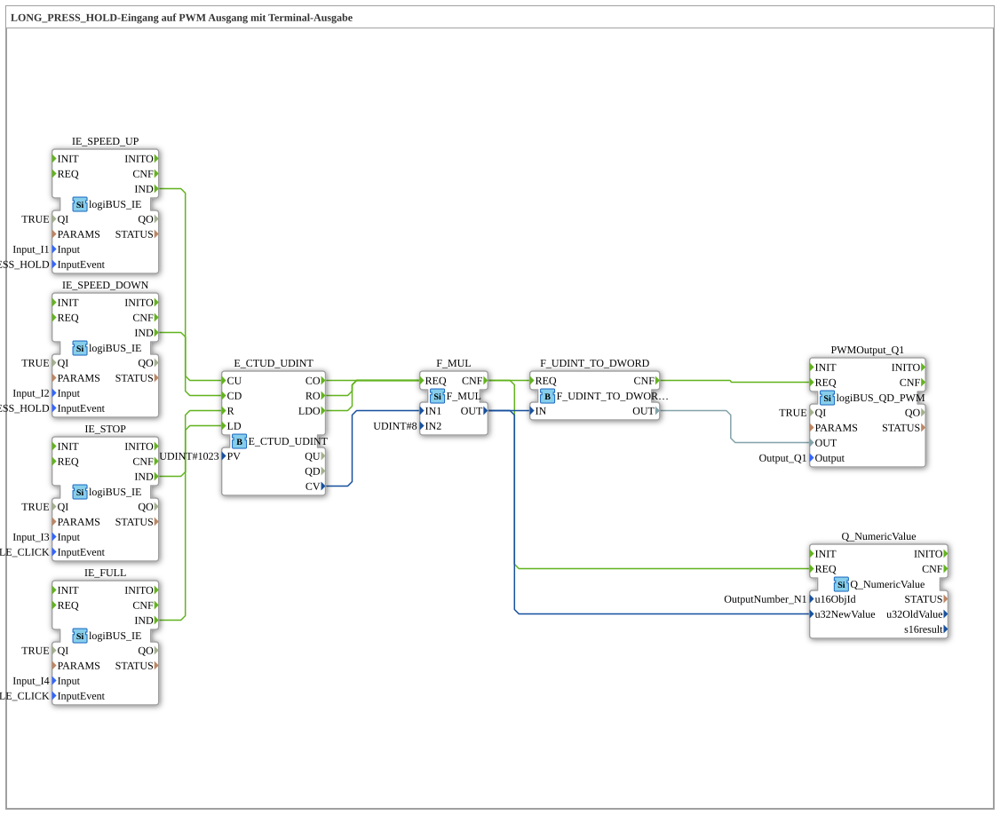

# Exercise_034b: LONG_PRESS_HOLD Input to PWM Output with Terminal Output

[(https://notebooklm.google.com/notebook/a6872e59-1dfc-4132-a118-aff1bc7bc944)
This article describes the logiBUS® exercise `Uebung_034b`. Here, the PWM power is controlled via button interactions ("accelerating").
----
## Objective of the Exercise

Combining repeating events (`HOLD`) and counters to control a PWM stage. The user can increase or decrease the power in steps by holding down a button.

-----

## Description and Components

[cite_start]In `Uebung_034b.SUB`, an up/down counter is used as a digital integrator[cite: 1].

### Function Blocks (FBs)

* **`IE_SPEED_UP`**: Sends an event every 200ms as long as button **I1** is held down.
* **`IE_SPEED_DOWN`**: Sends an event every 200ms as long as button **I2** is held down.
* **`E_CTUD_UDINT`**: Stores the current "power counter reading".
* **`F_MUL`**: Scales the counter reading (here by a factor of 8) to the target range for the PWM block.
* **`PWMOutput_Q1`**: The power output.

-----

## Functionality

1. **Increase**: The operator holds down **I1**. The counter increments by one step every 200 ms. The lamp at `Q1` gradually brightens.
2. **Decrease**: The operator holds down **I2**. The lamp gradually dims.
3. **Quick Select**: Button **I3** (Stop) immediately resets the value to
0. Button **I4** (Full) immediately loads the counter to its maximum.

This enables very precise control of drives or lighting via simple digital buttons.

---

### 🌐 Related topic subpages on ms-muc-docs.de

* [🌐 E_CTU Event Counter module on ms-muc-docs.de](https://www.ms-muc-docs.de/iec-61499/event-function-blocks/e_ctu/)
* [🌐 The PWM signal & infographic on ms-muc-docs.de](https://www.ms-muc-docs.de/automatisierung/das-pwm-signal-die-kunst-spannung-zu-zerhacken/das-pwm-signal-die-kunst-spannung-zu-zerhacken-website/)

]