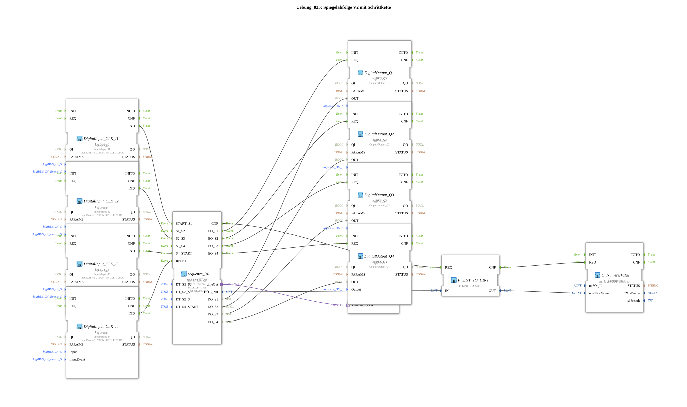

# Exercise_035: Mirror Sequence V2 with Step Chain

This article describes the logiBUS® exercise `Uebung_035`. It demonstrates the control of complex processes using a sequencer (step chain).
## 🎧 Podcast

* [Automation Decoded: Guiding, Controlling, Regulating – The Invisible Language of Technology (DIN IEC 60050-351)]](https://podcasters.spotify.com/pod/show/ms-muc-lama/episodes/Automatisierung-entschlsselt-Leiten--Steuern--Regeln--Die-unsichtbare-Sprache-der-Technik-DIN-IEC-60050-351-e36t52b)
* [Infineon CAN Transceiver TLE9250V versus TLE9351VSJ]](https://podcasters.spotify.com/pod/show/ms-muc-lama/episodes/Infineon-CAN-Transceiver-TLE9250V-versus-TLE9351VSJ-e3b8nan)
* [Infineon TLE9351VSJ: The Invisible Auto Bodyguard]](https://podcasters.spotify.com/pod/show/ms-muc-lama/episodes/Infineon-TLE9351VSJ-der-unsichtbare-Auto-Bodyguard-e3b8nhl)
* [JBC's Soldering Secret: 350 Degrees in 2 Seconds and Why the Tip Determines Efficiency and Lifespan]](https://podcasters.spotify.com/pod/show/ms-muc-lama/episodes/JBCs-Lt-Geheimnis-350-Grad-in-2-Sekunden-und-warum-die-Spitze-ber-Effizienz-und-Lebensdauer-entscheidet-e39arff)

----

## Objective of the Exercise

Using the module `sequence_ET_04`. This section demonstrates how a process is divided into four phases (`S1` to `S4`), with transitions that can be triggered by events or timers.

-----

## Description and Components

[cite_start]The subapplication `Uebung_035.SUB` controls four outputs in a fixed sequence[cite: 1].

### Function Blocks (FBs)
* **`sequence_04`**: The sequencer block. It manages the logic of the steps.
* **Parameters `DT_S1_S2` etc.**: Define the maximum dwell time in a step (here, 2 seconds each).
* **`Q_NumericValue`**: Displays the current step (1-4) on the terminal. * **`E_TimeOut`**: Monitors the sequence.

-----

## Functionality

1. **Start**: Button **I1** triggers `START_S1`. Lamp `Q1` turns on.

2. **Transition**: After 2 seconds (or due to an event on the corresponding port), the sequencer jumps to step 2. `Q1` turns off, `Q2` turns on.

3. **Continuation**: The process continues to step 4.

4. **Reset**: Button **I4** can interrupt the sequence at any time and deactivate all outputs.

-----

## Application Example

**Automatic Cleaning Cycle**:

One press of a button starts the program:

1. Rinse valves (2s),

2. Inject cleaning agent (2s),

3. Soak (2s),

4. Rinse (2s). The sequence of steps ensures that the phases run exactly sequentially and never simultaneously.

--

### 🌐 Related topic subpages on ms-muc-docs.de
* [🌐 Interactive JBC soldering tip guide & infographic on ms-muc-docs.de](https://www.ms-muc-docs.de/elektrotechnik/werkzeug/lötkolben/jbc-lötspitzen-übersicht/)

]
