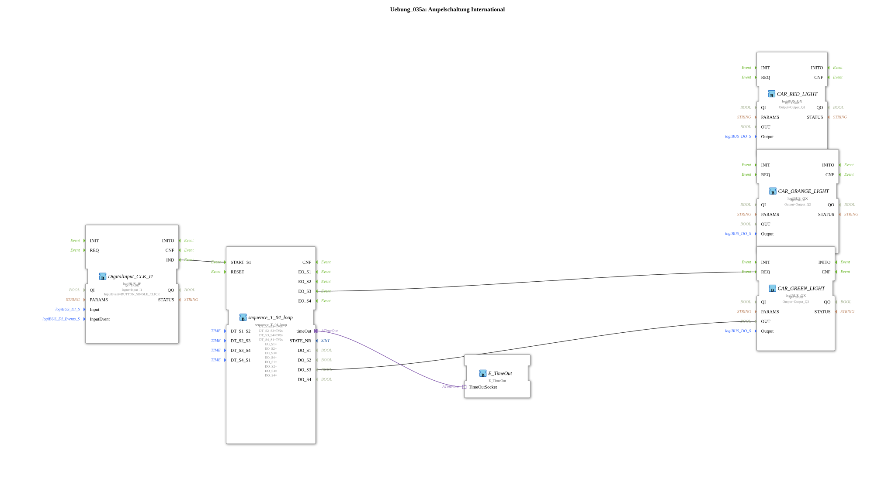

# Exercise_035a: Traffic Light Control International

This article describes the logiBUS® exercise `Uebung_035a`. Here, the control of a traffic light system is implemented using a timed sequence.
----
## Objective of the Exercise
Implementation of a complex timing sequence with overlapping states. The standard sequence for Germany is simulated: Red ➡️ Red-Yellow ➡️ Green ➡️ Yellow ➡️ Red.

-----

## Description and Components

[cite_start]In `Uebung_035a.SUB`, a 4-step sequencer is used as the clock generator[cite: 1].

### Functionality

The challenge lies in the mixed states (e.g., red and yellow lights illuminate simultaneously). This is solved using logical OR gates in sub-applications (`RED`, `ORANGE`):

1. **Step 1 (Red)**: Only the red output is active (6s).

2. **Step 2 (Red-Yellow)**: The event triggers both lights (2s).

3. **Step 3 (Green)**: Only green is illuminated (8s).

4. **Step 4 (Yellow)**: Only yellow is illuminated (2s).

The cycle then begins again. This demonstrates the combination of sequential processing and combinatorial logic.