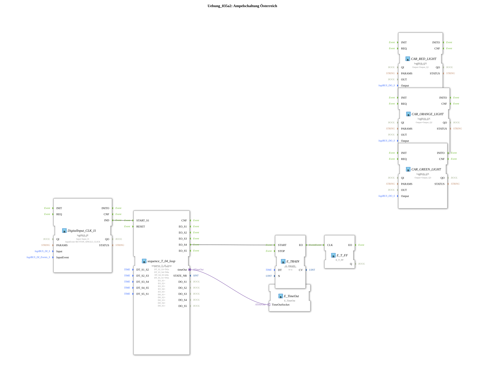

# Exercise_035a2: Traffic Light Control Austria

[(https://notebooklm.google.com/notebook/a6872e59-1dfc-4132-a118-aff1bc7bc944)
This article describes the logiBUS® exercise `Uebung_035a2`. Here, the traffic light control is extended to include the flashing green phase common in some countries (e.g., Austria).
----
## Overview

[cite_start]Using a 5-step sequencer, an additional state, "Flashing Green," is added[cite: 1].

After the green phase (step 3), the sequencer starts a `E_TRAIN` block (step 4). This generates four short pulses at 500 ms intervals, which, via a toggle flip-flop, cause the green light to flash. Only after this flashing sequence is complete does the system switch to the yellow phase (step 5). This demonstrates the seamless integration of sub-sequences within a higher-level step sequence.

