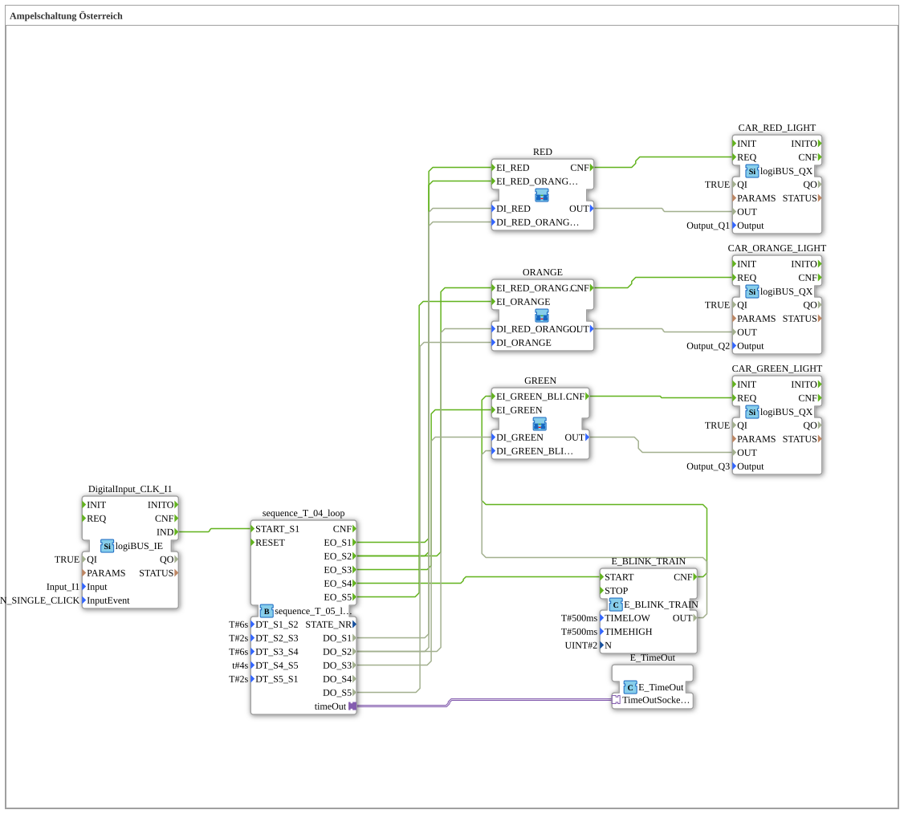

# Exercise_035a3: Traffic Light Control in Austria

## Overview

[cite_start]Structural variant of Exercise 035a2[cite: 1]. Instead of the `E_TRAIN` block, the specialized `E_BLINK_TRAIN` is used here to control the green-flashing phase even more precisely. The logic of the state overlap (red-yellow) is still implemented using sub-application OR gates.

