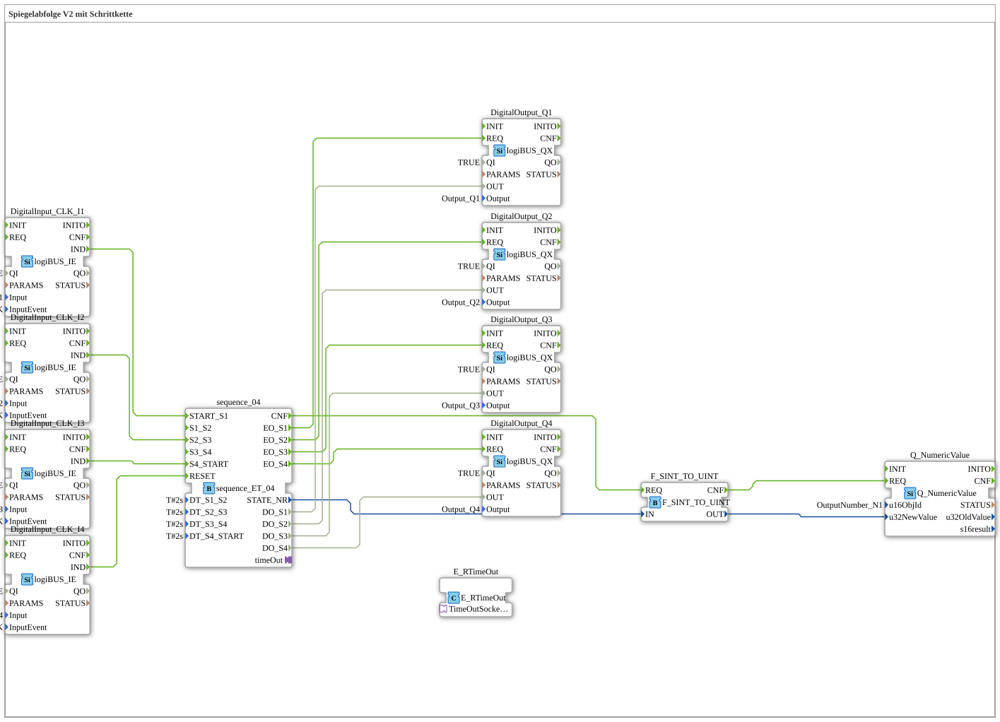

Here is the documentation for exercise **Exercise_035b** based on the provided XML data.

* * * * * * * * * *
This exercise implements a step chain controller (sequencer) called "Mirror Sequence V2." The goal is the sequential control of four digital outputs (Q1 to Q4). Additionally, the current status of the step chain is visualized as a numerical value on a user interface. Control is achieved via digital inputs, which can start, modify, or reset the sequence.

This application uses various function blocks from the libraries `logiBUS`, `isobus`, and `iec61131`.

* **DigitalInput_CLK_I1** to **DigitalInput_CLK_I4** (`logiBUS::io::DI::logiBUS_IE`): These function blocks process the physical input signals (pushbuttons). They are configured to respond to the event `BUTTON_SINGLE_CLICK`.
* **DigitalOutput_Q1** to **DigitalOutput_Q4** (`logiBUS::io::DQ::logiBUS_QX`): These function blocks control the physical outputs (lamps/actuators).
* **Q_NumericValue** (`isobus::UT::Q::Q_NumericValue`): Used to display a numeric value on a Universal Terminal (UT). The object ID `OutputNumber_N1` is used here.
* **F_SINT_TO_UINT** (`iec61131::conversion::F_SINT_TO_UINT`): A conversion block that converts the Short Integer (SINT) data type to Unsigned Integer (UINT) to make it compatible for display.
* **E_RTimeOut** (`iec61499::events::E_RTimeOut`): *Note: This block is placed in the network but is not currently wired in the exercise (according to the comment, this is a "TODO" for a future example).*

### Haupt-Bausteine
## Function Blocks Used (FBs)
## Introduction
# Uebung_035b: Spiegelabfolge V2 mit Schrittkette
### Sub-blocks: sequence_ET_04

This is the central logic block of the exercise.

* **Type**: `logiBUS::utils::sequence::combi::sequence_ET_04`
* **Description**: A 4-step sequence that operates based on time and events.
* **Parameters**:
* `DT_S1_S2` = `T#2s`: Time duration/delay between steps 1 and 2.
* `DT_S2_S3` = `T#2s`: Time duration/delay between steps 2 and 3.
* `DT_S3_S4` = `T#2s`: Time duration/delay between steps 3 and 4.
* `DT_S4_START` = `T#2s`: Time duration/delay after step 4 until restart.
* `DT_S4_START` = `T#2s`: Time duration/delay after step 4 until restart. * **Event Inputs (Used)**:
* `START_S1`: Starts the sequence at step 1.
* `S2_S3`: Triggers the transition or influences the change from step 2 to 3.
* `S4_START`: Triggers the transition or influences the change from step 4 back to the start.
* `RESET`: Resets the step sequence.
* **Outputs**:
* `EO_S1` to `EO_S4`: Event outputs that fire when the respective step becomes active.
* `DO_S1` to `DO_S4`: Data outputs (BOOL) that carry the status of the respective step.
* `STATE_NR`: Outputs the current step number as a number.

The exercise sequence is determined by the interaction of the buttons with the sequencer module:

1. **Sequence Control**:

* Button **I1** is connected to input `START_S1`. A click starts the sequence.
* Button **I2** interacts with transition `S2_S3`.
* Button **I3** interacts with transition `S4_START`.
* Button **I4** is connected to input `RESET` and stops/resets the entire sequence.
* 2. **Signal Output**:
* The sequencer `sequence_04` switches the outputs depending on the active step:
* Step 1 activates **Q1**.
* Step 2 activates **Q2**.
* Step 3 activates **Q3**.
* Step 4 activates **Q4**.
* The time parameters (T#2s) in the sequencer indicate that the steps have a defined runtime or that automatic transitions occur after 2 seconds, provided they are not overdriven by the inputs.

3. **Visualization**:

* The current step number (`STATE_NR` from the sequencer) is sent to the converter `F_SINT_TO_UINT`.
* The converted value (`u32NewValue`) is passed to the function block `Q_NumericValue` to display the active step number on the display (object `OutputNumber_N1`).

Exercise **Exercise_035b** demonstrates the implementation of a more complex step sequencer (`sequence_ET_04`) within the 4diac IDE. It combines manual user input (start, reset, specific transition triggers) with time-based parameters to sequentially switch four outputs. Simultaneously, the internal state of the logic (the step number) is visualized for the user on a display.

* [🌐 Eclipse 4diac IDE & Color Reference on ms-muc-docs.de](https://www.ms-muc-docs.de/iec-61499/eclipse-4diac/)

]

## Program Flow and Connections
## Summary
### 🌐 Passende Themen-Unterseiten auf ms-muc-docs.de