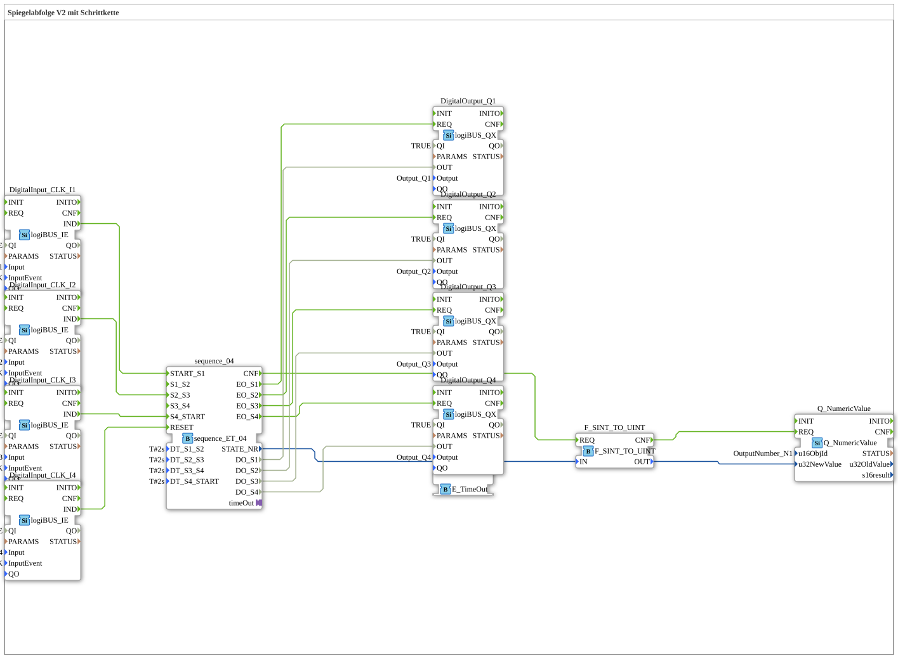

Here is the documentation for exercise **Exercise_035c** in the requested format.
# Exercise_035c: Mirror Sequence V2 with Step Chain

*(Insert image of the exercise here, if available)*

* * * * * * * * * *
## Introduction
Exercise **Exercise_035c** ("Mirror Sequence V2 with Step Chain") demonstrates the control of a sequential sequence (step chain) with four states. Both time-controlled and event-driven transitions are used. The current status of the step chain is visualized via digital outputs (LEDs), and the number of the active step is displayed on a numeric display.

## Function Blocks (FBs) Used

This exercise uses various standard and logic blocks to implement the input and output as well as the sequence control.

### Main Components
* **DigitalInput_CLK_I1 to I4** (`logiBUS::io::DI::logiBUS_IE`):
* Used to read the button signals (Input_I1 to Input_I4).
* Configured for the event `BUTTON_SINGLE_CLICK`.
* **DigitalOutput_Q1 to Q4** (`logiBUS::io::DQ::logiBUS_QX`):
* Control the physical outputs (Output_Q1 to Output_Q4) to indicate the active step.
* **Q_NumericValue** (`isobus::UT::Q::Q_NumericValue`):
* Used to visualize a numeric value on the display (object ID `OutputNumber_N1`).
* **F_SINT_TO_UINT** (`iec61131::conversion::F_SINT_TO_UINT`):
* Converts the step number (SINT) to an unsigned integer (UINT) so that it can be processed by the `Q_NumericValue` function block.
* **E_TimeOut** (`iec61499::events::E_TimeOut`):
* A system function block for timing functions, connected to the step sequence via an adapter.

### Sub-function blocks: sequence_04

This function block is the core of the logic control.

* **Type**: `logiBUS::utils::sequence::combi::sequence_ET_04`
* **Internal Function Blocks Used**: (Logic encapsulates a state machine with timers)
* **Parameters**:
* `DT_S1_S2` = `T#2s`: Delay time for the transition from step 1 to 2.
* `DT_S2_S3` = `T#2s`: Delay time for the transition from step 2 to 3.
* `DT_S3_S4` = `T#2s`: Delay time for the transition from step 3 to 4.
* `DT_S4_START` = `T#2s`: Delay time for the return to the start.
* `DT_S4_START` = `T#2s`: Delay time for the return to the start. * **Event Inputs**:
* `START_S1`: Starts the sequence at step 1 (connected to button I1).
* `S2_S3`: Trigger for the transition from step 2 to 3 (connected to button I2).
* `S4_START`: Trigger for restarting after step 4 (connected to button I3).
* `RESET`: Resets the sequence (connected to button I4).
* **Data Outputs**:
* `DO_S1` to `DO_S4`: Status signals for outputs Q1 to Q4.
* `STATE_NR`: Outputs the current step number as a number.

## Program Flow and Connections

The logic combines automatic time transitions with manual user intervention.

1. **Starting the Sequence**:

* Pressing **Button I1** triggers the event `START_S1`.
* The step sequence jumps to **State 1**.
* Output **Q1** is activated.

2. **Automatic and Manual Transitions**:

* **S1 -> S2**: Since no explicit event is wired for this transition, the change to **State 2** (Q2 on) occurs automatically after the time `DT_S1_S2` (2 seconds) has elapsed.
* **S2 -> S3**: The transition to **State 3** (Q3 on) requires manual confirmation via **Button I2**, as this is connected to input `S2_S3`. The time `DT_S2_S3` likely serves as the minimum waiting time or timeout basis.
* **S3 -> S4**: The transition to **State 4** (Q4 on) occurs automatically after `DT_S3_S4` (2 seconds) has elapsed, as no button event is connected.
* **S4 -> Start**: To restart the sequence from State 4, **Button I3** must be pressed (input `S4_START`).

3. **Visualization**:

* In parallel with the LEDs, the current step number (`STATE_NR`) is sent via the converter to the block `Q_NumericValue` and displayed on the display (OutputNumber_N1).

4. **Reset**:

* The **button I4** is connected to the `RESET` input and resets the entire step sequence to its initial state (all outputs off) at any time.

## Summary

This exercise deepens the understanding of complex step sequences in IEC 61499. It demonstrates how manual interventions (triggered by buttons) can be combined with automatic timing sequences. Furthermore, the processing of numerical data for status indication and the conversion of data types (`SINT_TO_UINT`) are applied practically.
