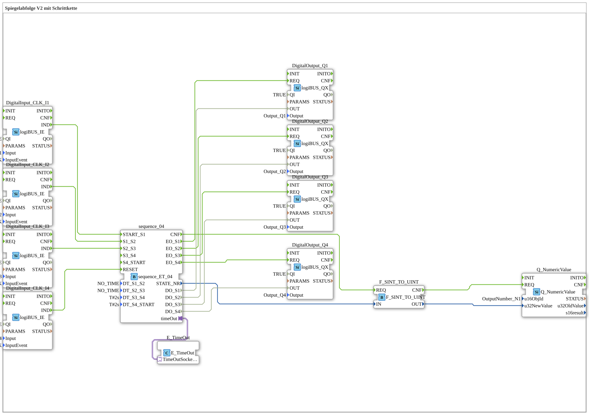

# Exercise_036: Mirror Sequence V2 with Step Chain

[(https://notebooklm.google.com/notebook/a6872e59-1dfc-4132-a118-aff1bc7bc944)
This article describes the logiBUS® exercise `Uebung_036`. Unlike exercise 035, the focus here is on manual advancement via events
----

## Objective of the Exercise

Implementation of a step chain without automatic time transitions.

-----

## Functionality

[cite_start]In `Uebung_036.SUB`, the time parameters `DT_S1_S2` and `DT_S2_S3` are set to the value `NO_TIME`[cite: 1].

This means: The sequencer remains in step 1 until it receives an explicit event at input `S1_S2`. In this exercise, this is triggered by the **I2** button. Similarly, **I3** switches from step 2 to 3. Only the last steps use the automatic timer (2s) again.

-----

## Application Example

**Manual Placement Process**: An operator inserts a part and presses "Done" (`I2`). The machine executes the first processing step. It then waits for the operator's release (`I3`) before continuing. The sequence of steps thus adapts to the human work pace.
