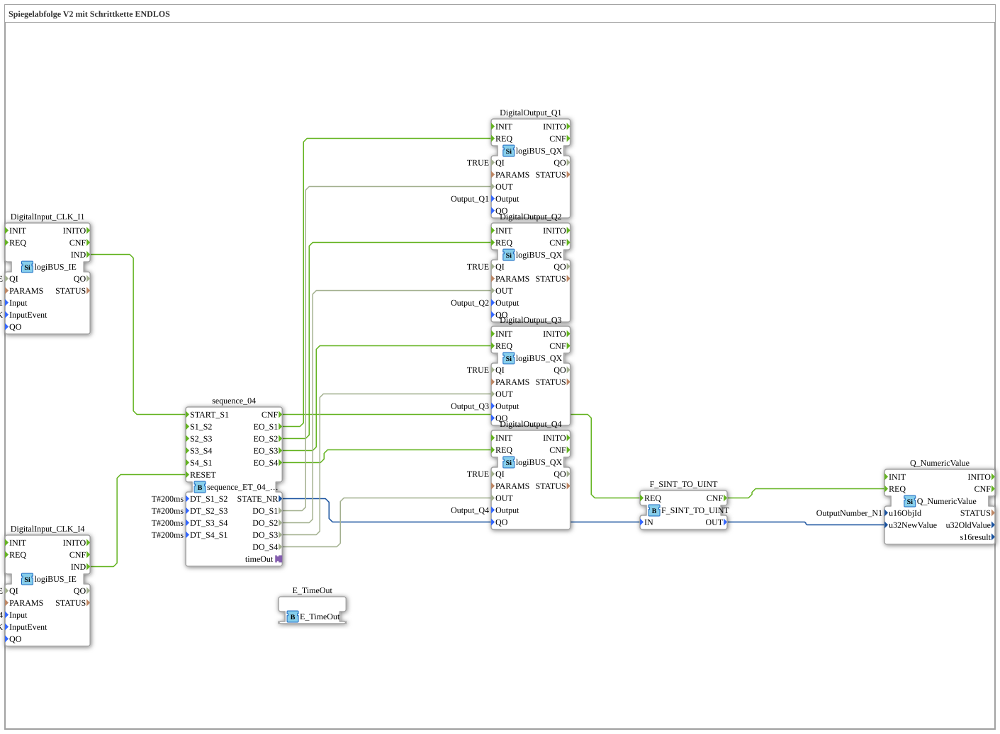

# Exercise_037: Mirror Sequence V2 with Continuous Step Chain

[(https://notebooklm.google.com/notebook/a6872e59-1dfc-4132-a118-aff1bc7bc944)
This article describes the logiBUS® exercise `Uebung_037`. Here, a cyclically repeating sequence is programmed.
----
## Overview

[cite_start]This exercise uses the function block `sequence_ET_04_loop`[cite: 1]. Once the sequence is started by button **I1**, it continuously executes steps 1 to 4. After completing step 4, it automatically returns to step 1. The cycle is only interrupted and the machine stopped by pressing the reset button **I4**. This is ideal for continuous operation or periodic mechanical movements.