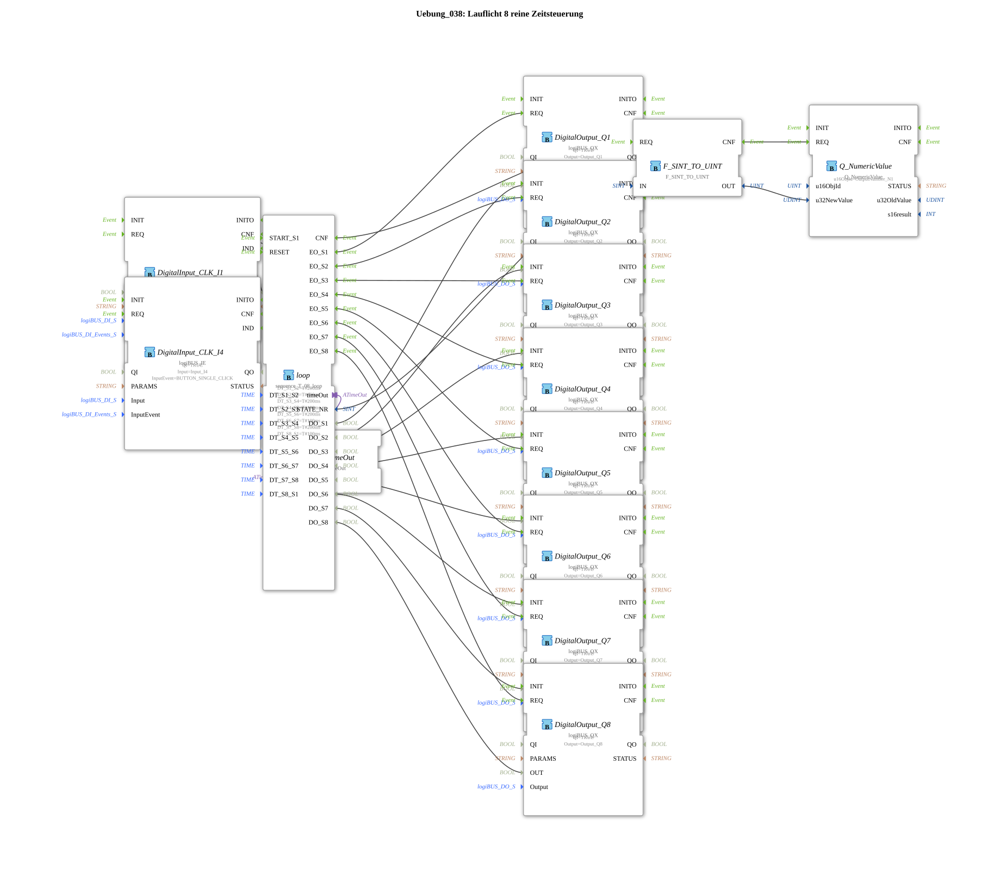

# Exercise_038: Running Light 8 - Pure Time Control

This article describes the logiBUS® exercise `Uebung_038`. Here, a more complex step sequence with 8 phases is implemented.
----
## Overview

[cite_start]Using the function block `sequence_T_08_loop`, an automatic running light is generated via 8 outputs (`Q1` to `Q8`)[cite: 1].

The transition times between the lights are individually adjustable (e.g., 200 ms for the odd steps, 100 ms for the even steps). The program demonstrates the handling of multiple parallel outputs and the numerical feedback of the current system status to the terminal.

[cite_start] 
