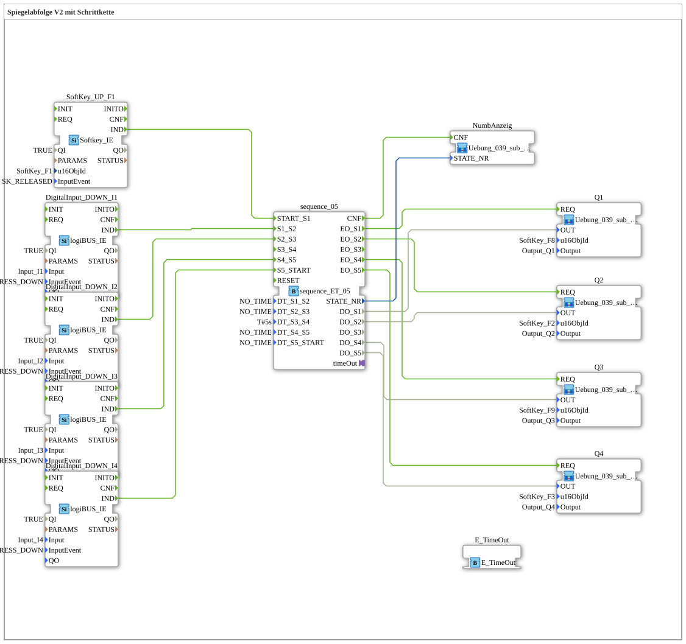

# Exercise_039: Mirror Sequence V2 with Step Chain

This article describes the logiBUS® exercise `Uebung_039`. This exercise is specifically designed for controlling hydraulic or pneumatic directional control valves.

----

## Objective of the Exercise

Implementation of a complex mirror sequence. Unlike simple cylinders, directional control valves often need to maintain states (center position locked), which requires precise timing and event-based control of the coils.

-----

## Description and Components

[cite_start]The subapplication `Uebung_039.SUB` uses a 5-step sequencer (`sequence_ET_05`)[cite: 1].

[cite_start] The hardware is controlled via standardized sub-applications (`Uebung_039_sub_Outputs`), which provide visual feedback on the respective valve status on the ISOBUS terminal by changing the color of the corresponding softkeys.

-----

## Functionality

The chain is manually controlled by physical pushbuttons (`I1` to `I4`), with a central time step (5 seconds in `DT_S3_S4`) inserting an automatic safety or waiting phase. This illustrates the combination of free operation and enforced process times.

