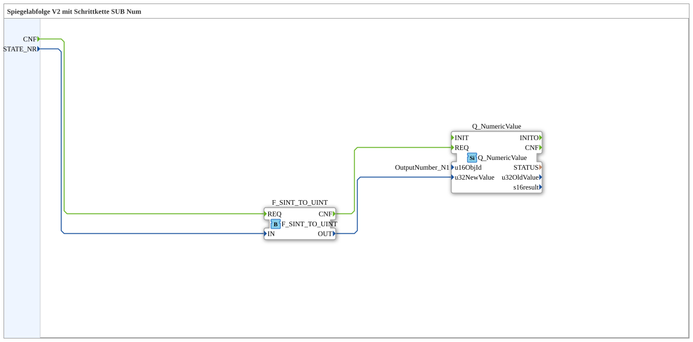

Here is the generated documentation based on the provided XML code:
# Exercise_039_sub_NumbDisplay: Mirror Sequence V2 with Step Chain SUB Num

* * * * * * * * * *
## Introduction
The sub-application **Exercise_039_sub_NumbDisplay** is a utility component designed to display numeric values within the context of a step chain (mirror sequence V2). Its main task is to receive a status number (`STATE_NR`), convert it into a suitable data format, and then send it to an output element (ISOBUS Universal Terminal).

## Function Blocks (FBs) Used

This exercise defines a sub-block that internally uses standard conversion blocks as well as ISOBUS communication blocks.

### Sub-Blocks: Exercise_039_sub_NumbDisplay
- **Type**: SubAppType
- **Description**: Mirror sequence V2 with step chain SUB Num
- **Internal Function Blocks Used**:
- **F_SINT_TO_UINT**: `iec61131::conversion::F_SINT_TO_UINT`
- **Function**: Converts a `SINT` (Short Integer) value to a `UINT` (Unsigned Integer) value.
- **Data Input**: `IN` (Connected to external input `STATE_NR`)
- **Data Output**: `OUT` (Sends the converted value to `Q_NumericValue`)
- **Event Input**: `REQ` (Triggered by external event `CNF`)
- **Event Output**: `CNF` (Trigger for `Q_NumericValue`)
- **Q_NumericValue**: `isobus::UT::Q::Q_NumericValue`
- **Function**: Updates a numeric value on an ISOBUS terminal.
- **Parameters**: `u16ObjId` = `OutputNumber_N1` (Reference to the specific display object)
- **Data Input**: `u32NewValue` (Receives the converted value from `F_SINT_TO_UINT`)
- **Event Input**: `REQ` (Trigger to update the value)
- **Functionality**:

The sub-module receives a signed integer (`SINT`), converts it to an unsigned integer (`UINT`) because the target object (Numeric Value) expects this format, and sends the value to the defined user interface object `OutputNumber_N1`.

## Program Flow and Connections

The flow within this sub-module is strictly linear and event-driven:

1. **Input Signal**:

Processing begins when the event `CNF` is received by the sub-module. Simultaneously, the value for `STATE_NR` (the current step number) is passed.

2. **Data Conversion**:

The event is forwarded to the module `F_SINT_TO_UINT`. This module reads the value from `STATE_NR`, converts it to the `UINT` format, and outputs the result to its output `OUT`.

3. **Display Update**:

Once the conversion is confirmed (event `CNF` from `F_SINT_TO_UINT`), the function block `Q_NumericValue` is activated.

* It adopts the converted value at input `u32NewValue`.
* The parameter `u16ObjId` is fixed at `OutputNumber_N1`, meaning that this is the field that will be updated on the user interface.

**Connection Overview:**

* **Event**: `CNF` (Input) → `F_SINT_TO_UINT.REQ` → `F_SINT_TO_UINT.CNF` → `Q_NumericValue.REQ`.
* **Data**: `STATE_NR` (Input) → `F_SINT_TO_UINT.IN` → `F_SINT_TO_UINT.OUT` → `Q_NumericValue.u32NewValue`.

## Summary
The exercise **Exercise_039_sub_NumbDisplay** demonstrates the encapsulation of logic in a sub-application. It serves as an interface between the control logic (sequence of steps) and the visualization (ISOBUS terminal) by adapting data types and handling communication with the output object `OutputNumber_N1`. This promotes reusability and clarity in the main program.

## 🛠️ Related exercises
* [Uebung_039](Uebung_039.md)
* [Uebung_039a](Uebung_039a.md)

