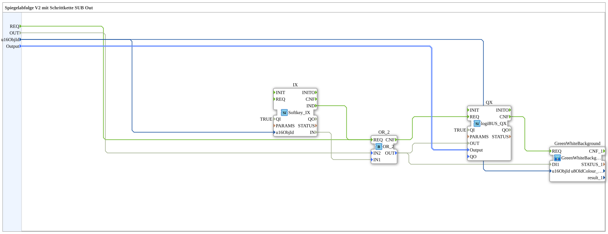

Here is the documentation page for the provided exercise file.
# Exercise_039_sub_Outputs: Mirror Sequence V2 with Step Chain SUB Out

*(Placeholder for exercise image)*
* * * * * * * * * *
## Introduction

This documentation describes the sub-application `Uebung_039_sub_Outputs`. This module is part of a more complex control system (presumably "Mirror Sequence V2 with Step Chain") and serves as an interface between the control logic, the hardware, and the user interface (ISOBUS VT).

The main purpose of this module is to control a digital output, where two sources can activate the signal: an automatic signal from the program or manual activation via a softkey on the terminal. The status is also visually indicated.

## Function Blocks Used (FBs)

In this sub-application, various function blocks are interconnected to implement the input, logic, and output functions.

### Sub-Blocks: Exercise_039_sub_Outputs

This block encapsulates the logic for a single actuator/output.

- **Type**: SubAppType
- **Internal FBs Used**:
- **QX**: `logiBUS::io::DQ::logiBUS_QX`
- **Description**: Driver block for a physical digital output on the logiBUS.
- **Parameters**: `QI` = `TRUE` (Block is activated).
- **Data Input**:
- `Output`: Connected to the external input `Output` (defines the hardware address).
- `OUT`: Receives the switching signal from the `OR_2` module.
- **Event Input**: `REQ` (trigger for updating the output).
- **IX**: `isobus::UT::io::Softkey::Softkey_IX`
- **Description**: Input module for reading a softkey (button) on an ISOBUS terminal.
- **Parameters**: `QI` = `TRUE`.
- **Data Input**: `u16ObjId` (Softkey object ID).
- **Data Output**: `IN` (Current button status).
- **Event Output**: `IND` (Indication - Signals status change/update).
- **OR_2**: `iec61131::bitwiseOperators::OR_2`
- **Description**: Logical OR gate.
- **Data Input**:
- `IN1`: Connected to `IX.IN` (Softkey status).
- `IN2`: Connected to external input `OUT` (Control signal).
- **Functionality**: The output becomes TRUE when either the softkey is pressed OR the external control signal is present.
- **GreenWhiteBackground**: `MyLib::sys::GreenWhiteBackground`
- **Description**: Another sub-application (presumably for visualization) that controls the background of the softkey (e.g., green when active, white when inactive).
- **Data Input**:
- `DI1`: Connected to the result of the OR logic (`OR_2.OUT`).
- `u16ObjId`: The ID of the object to be colored.
- **Functionality**:

This function block combines hardware control and HMI interaction. It continuously checks whether there is a request to set the output. This is achieved by linking manual intervention (softkey `IX`) and automatic requests (`OUT`). The result is written directly to the hardware (`QX`) and simultaneously used for visualization (`GreenWhiteBackground`).

## Program Flow and Connections

The data and event flow within the sub-application is as follows:

1. **Initialization and Triggers**:

* The module reacts to the external event `REQ` or to a `IND` event from the softkey (`IX`).

``` * The object ID for the softkey (`u16ObjId`) and the hardware address (`Output`) are passed from the outside to the internal function blocks `IX`, `QX`, and `GreenWhiteBackground`.

2. **Logical operation (OR)**:

* The function block `OR_2` receives two Boolean signals:
* `IN1`: The status of the softkey (`IX.IN`).
* `IN2`: The external input `OUT` (e.g., from a step sequence).

``` * As soon as one of these signals is `TRUE`, the output of `OR_2` switches to `TRUE`. This enables an "OR" logic: The actuator runs when the automation system **or** the operator presses the button.

3. **Output and Feedback**:

* The result of the OR operation triggers the hardware output `QX`.
* Simultaneously, the result is passed to the sub-application `GreenWhiteBackground`. As soon as the hardware output is active (confirmed by `QX.CNF`), the visualization is updated (the softkey will likely turn green).

3. **Output and Feedback**:

* The result of the OR operation triggers the hardware output `QX`.
* Simultaneously, the result is passed to the sub-application `GreenWhiteBackground`. As soon as the hardware output is active (confirmed by `QX.CNF`), the visualization is updated (the softkey will likely be highlighted in green).
* ## Summary

The exercise/module `Uebung_039_sub_Outputs` presents a robust module for actuator control. It demonstrates how to implement logical decoupling of automatic and manual operation in 4diac and link this directly to physical hardware and a user interface. By encapsulating it in a sub-application, this module can be instantiated multiple times to control different outputs of a machine (e.g., in a mirror sequence) identically.

---

### 🌐 Related topic subpages on ms-muc-docs.de
* [🌐 Eclipse 4diac IDE & color reference on ms-muc-docs.de ](https://www.ms-muc-docs.de/iec-61499/eclipse-4diac/)
