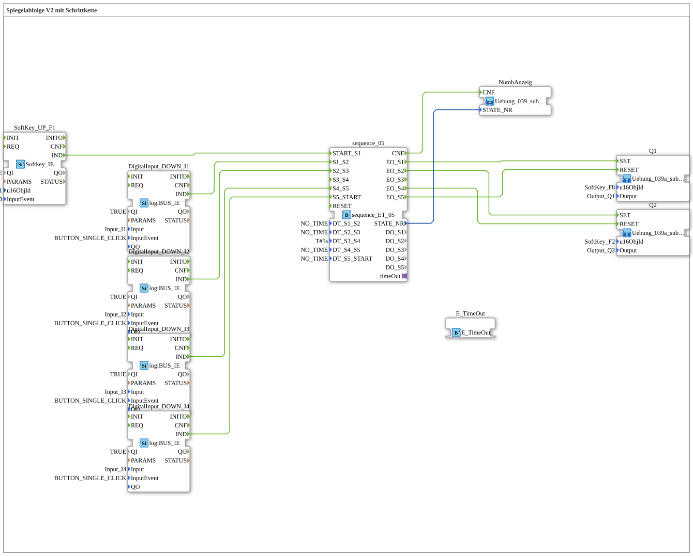

# Exercise_039a: Mirror Sequence V2 with Step Chain

[(https://notebooklm.google.com/notebook/a6872e59-1dfc-4132-a118-aff1bc7bc944)

## Overview

[cite_start]This exercise is a specialization of valve control for systems with 3/2-way valves [e.g., hydraulic ring systems like those used by Claas](cite: 1).
The step chain (`sequence_ET_05`) manages the sequence of cylinder movements. The physical outputs are controlled via the sub-app `Uebung_039a_sub_Outputs`, which also provides direct visual feedback on the ISOBUS softkey. This demonstrates the adaptability of the logiBUS sequence blocks to various hydraulic wiring concepts.

