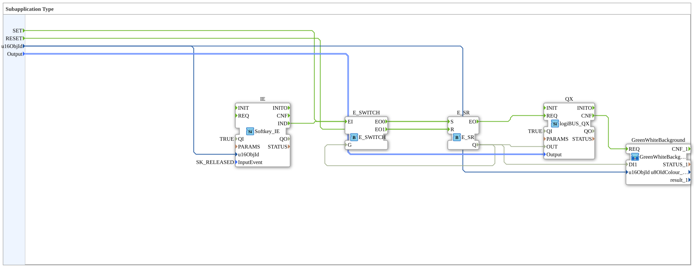

Here is the documentation for the exercise based on the provided XML data.
# Exercise_039a_sub_Outputs: Subapplication Type
![Image of the exercise, if available]

* * * * * * * * * *
## Introduction

The **Exercise_039a_sub_Outputs** is a sub-application type designed to control a digital output (LogiBUS Output) via an ISOBUS softkey. The logic includes a toggle function when the softkey is pressed, visual feedback through a background color change on the terminal, and external set and reset capabilities.

## Function Blocks (FBs) Used

This sub-application uses various function blocks and another sub-application to implement the control logic and visual feedback.

### Sub-Blocks: GreenWhiteBackground

This sub-application is used to visually display the output status on the screen.

- **Type**: `MyLib::sys::GreenWhiteBackground`
- **Internal Function Blocks Used**:
- *Note: Since the internal code of this block is not available here, the description is based on the wiring.*
- **Functionality**:

This block receives an object ID (`u16ObjId`) and a digital status (`DI1`). When the output is switched (triggered via `REQ`), this block likely changes the background color of the corresponding UI object (e.g., green for active, white for inactive).

### Further Function Blocks

#### IE (Softkey Input Event)
- **Type**: `isobus::UT::io::Softkey::Softkey_IE`
- **Parameters**:
- `QI` = `TRUE`
- `InputEvent` = `SK_RELEASED` (Reacts to key release)
- `u16ObjId` = Connected to input `u16ObjId`
- **Functionality**: Monitors a specific ISOBUS softkey. When this key is released, the function block sends an event at output `IND`.

#### E_SWITCH (Event Switch)
- **Type**: `iec61499::events::E_SWITCH`
- **Function**: Acts as an event switch. Depending on the input `G`, the incoming event `EI` is routed to either `EO0` (if G=0) or `EO1` (if G=1). This is central to the toggle logic.

#### E_SR (Set/Reset Flip-Flop)
- **Type**: `iec61499::events::E_SR`
- **Function**: A bistable element that stores the state (On/Off). An event at `S` sets the output `Q` to TRUE, an event at `R` sets it to FALSE.

#### QX (LogiBUS Output)
- **Type**: `logiBUS::io::DQ::logiBUS_QX`
- **Parameters**: `QI` = `TRUE`
- **Function**: This function block controls the physical or logical output of the LogiBUS system. It takes the state of `OUT` and writes it to the variable defined at the data input `Output`.

## Program Flow and Connections

The flow within this sub-application can be described as follows:

1. **Initialization**: The sub-application receives an external `u16ObjId` (which key/UI element is being controlled) and a reference to a physical `Output`.

2. **User Interaction (Toggle Logic)**:

* When the user presses and releases the corresponding softkey, the **IE** block fires an event.
* This event is sent to the **E_SWITCH**.
* The **E_SWITCH** checks the current state of the system (feedback from **E_SR.Q** to **E_SWITCH.G**).
* If the output is currently OFF (Q=FALSE), the event is sent to the **Set** input of the **E_SR** -> The output is switched ON.
* If the output is currently ON (Q=TRUE), the event is routed to the **Reset** input of the **E_SR** -> The output is switched OFF.

3. **External Control**:

* The state of the **E_SR** block can be directly manipulated via the external event inputs `SET` and `RESET`, independent of softkey activation.

4. **Output Control**:

* Every state change at the **E_SR** triggers the **QX** block, which writes the value to the hardware output.

5. **Visual Feedback**:

* After the **QX** block sends the confirmation (`CNF`), the sub-application **GreenWhiteBackground** is triggered.
* This receives the current state (`E_SR.Q` connected to `DI1`) and updates the display on the terminal.

### Learning Objectives and Special Features
* Creation of a reusable component (sub-application) for UI elements.
* Implementation of a **toggle function** (on/off with a button) using standard events (E_SWITCH and E_SR).
* Synchronization of hardware outputs and UI display.
* Handling ISOBUS softkey events.

## Summary

`Uebung_039a_sub_Outputs` represents a complete function block that links a softkey to a digital output. It offers integrated toggle functionality as well as automatic visual updates of the button on the display. The additional `SET` and `RESET` inputs allow for flexible integration into higher-level control logic.

## 🛠️ Related Exercises
* [Exercise_039a](Uebung_039a.md)]
