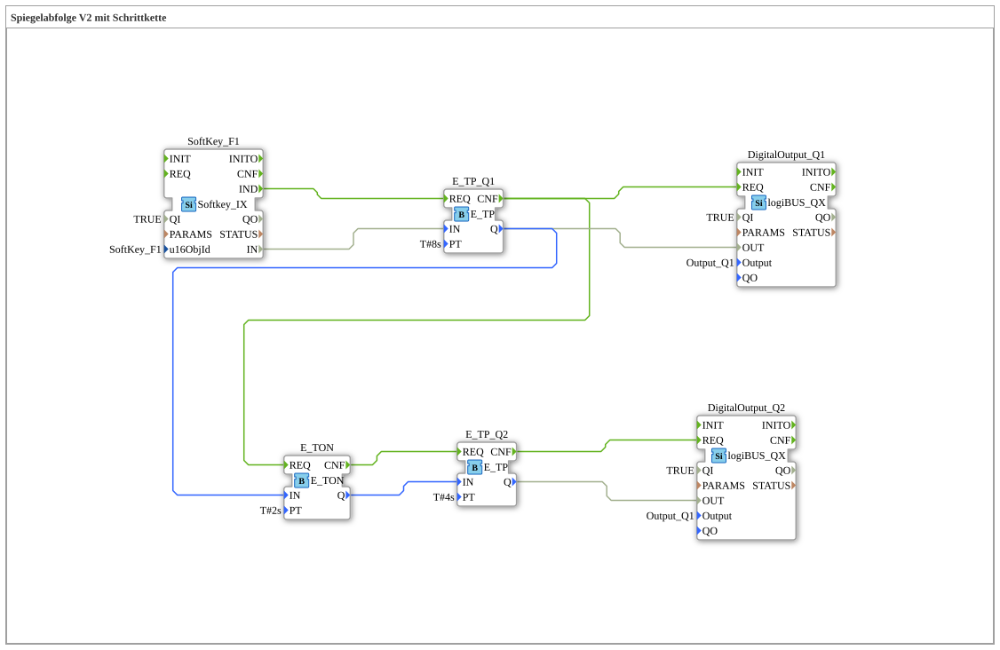

# Exercise_039b: Mirror Sequence V2 with Step Chain

## Overview
[cite_start]In this exercise, a time-controlled valve sequence is implemented using pulse generators (`E_TP`)[cite: 1].

A click on the softkey **F1** starts a chain of events:

1. Valve **Q1** is opened for 8 seconds.

2. After a delay of 2 seconds (`E_TON`), valve **Q2** is added for 4 seconds.

This enables the programming of fixed hydraulic function cycles (e.g., "bale ejection") in which several actuators must operate with a precise time offset.