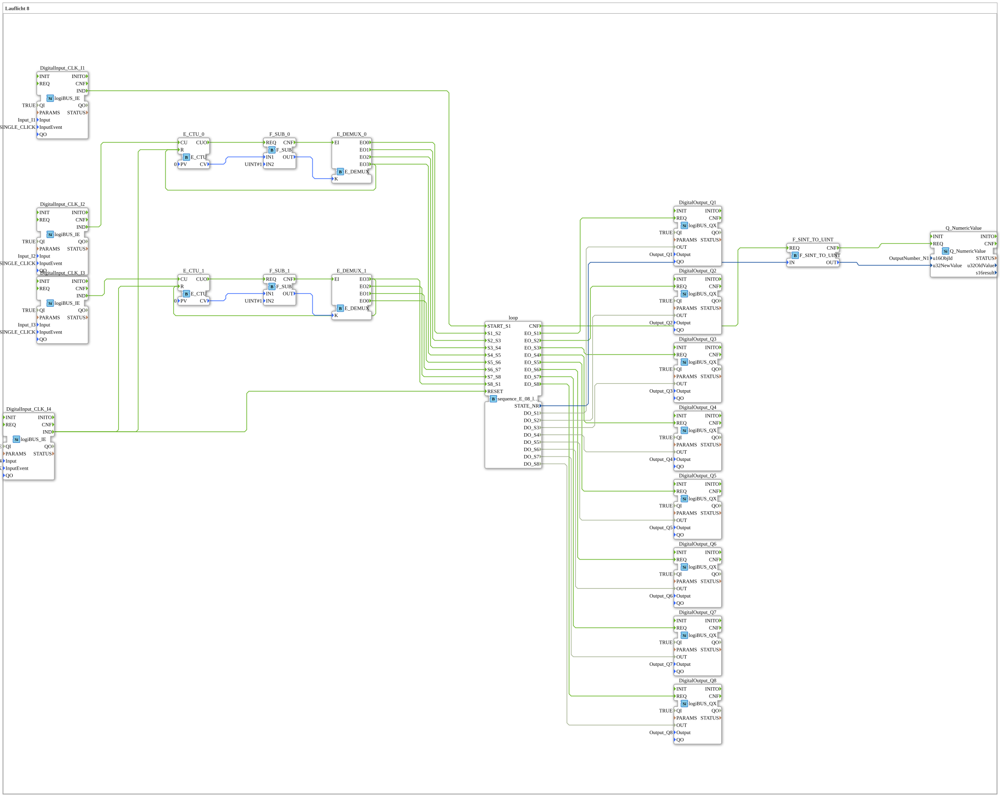

# Exercise_040: Running Light 8

[(https://notebooklm.google.com/notebook/a6872e59-1dfc-4132-a118-aff1bc7bc944)
This article describes the logiBUS® exercise `Uebung_040`. It demonstrates a sophisticated method for manually switching through an 8-step sequence using only a few buttons.
Exercise_040: Running Light 8
[(https://notebooklm.google.com/notebook/a6872e59-1dfc-4132-a118-aff1bc7bc944)

This article describes the logiBUS® exercise `Uebung_040`. It shows a sophisticated method for manually switching through an 8-step sequence using only a few buttons.]
## 📺 Video

* [From 1,400 errors to zero ](https://www.youtube.com/watch?v=jBk9Y-EX8zE)

## 🎧 Podcast

* [From 1,400 errors to clean code: Migrating the "Grain Hoe" to Eclipse 4diac™ 3.0 and the power of AX adapters ](https://podcasters.spotify.com/pod/show/logibus/episodes/Von-1400-Fehlern-zum-sauberen-Code-Die-Migration-der-Getreidehacke-auf-Eclipse-4diac-3-0-und-die-Macht-der-AX-Adapter-e3ahcko)
* [Digitizing 400 million tons of agricultural logistics ](https://podcasters.spotify.com/pod/show/ms-muc-lama/episodes/400-Millionen-Tonnen-Agrar-Logistik-digitalisieren-e3b8o5m)
* [Schlüter 1500 Special: Turbo toxicity, 40 years, and the soul of a powerhouse ](https://podcasters.spotify.com/pod/show/ms-muc-lama/episodes/Schlter-1500-Spezial-Turbo-Giftigkeit--40-Jahre-und-die-Seele-eines-Kraftprotzes-e39au2l)

----

## Goal of the exercise

Combining event counters (`E_CTU`) and Event demultiplexer (`E_DEMUX`) for controlling a sequence.

-----

## Description and Components

[cite_start]The subapplication `Uebung_040.SUB` uses two counter branches to control the event inputs of the sequencer `sequence_E_08_loop`[cite: 1].

### Functionality

1. **Start**: Button **I1** sets the sequence to the beginning (step 1).
2. **Steps 1-4**: Each click of button **I2** increments the first counter. The demultiplexer forwards the click event sequentially to the inputs `S1_S2`, `S2_S3`, etc. The user thus "clicks" their way through the first four phases.
3. **Steps 5-8**: Button **I3** takes over control for the second half of the chain.
4. **Counter Reset**: As soon as a demultiplexer reaches its last output, it automatically resets its corresponding counter to zero.

This is a very efficient method for mapping complex manual processes in a very small space (few controls).

---

### 🌐 Related topic subpages on ms-muc-docs.de

* [🌐 E_CTU Event Counter Block on ms-muc-docs.de](https://www.ms-muc-docs.de/iec-61499/event-function-blocks/e_ctu/)
* [🌐 Eclipse 4diac IDE & Color Reference on ms-muc-docs.de](https://www.ms-muc-docs.de/iec-61499/eclipse-4diac/)
