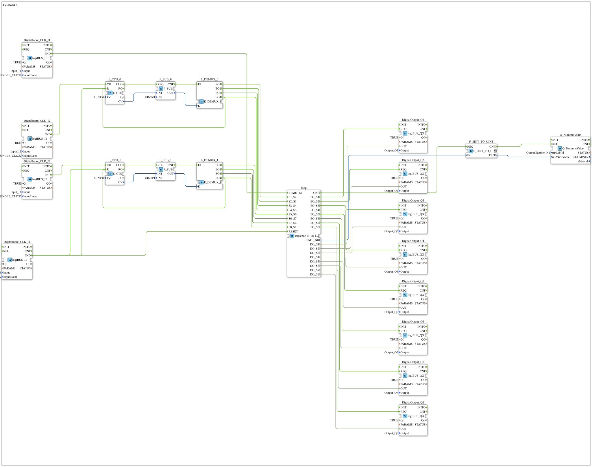

Here is the documentation for exercise `Uebung_040_2` based on the provided XML data.
# Exercise_040_2: Running Light 8

* * * * * * * * * *
## Introduction
This exercise implements an **8-channel running light**, which is manually controlled via pushbuttons. Unlike an automatically running running light, the sequence progress here is determined by user interaction. The system is divided into two blocks, each controlling 4 steps, and includes visual feedback on the current status as well as a numerical display of the active step.

## Function Blocks (FBs) Used

In this exercise, various standard and custom function blocks are used to implement the logic, input/output, and sequence control.

## Sub-Blocks: sequence_E_08_loop
This is the central block for controlling the states of the running light.

- **Type**: `logiBUS::utils::sequence::event::sequence_E_08_loop`
- **Internal Function Blocks Used**: (Assumed based on the interface)
- **Internal Logic**: State Machine
- **Functionality**:

This function block manages 8 sequential states (S1 to S8). It has event inputs to trigger specific transitions (e.g., `S1_S2` for switching from step 1 to 2).

- **Inputs**: `START_S1` (initialization), `RESET` (reset), and various transition triggers (`S1_S2`, `S2_S3`, etc.).
- **Outputs**: For each state, there is an event (`EO_S1`..`EO_S8`) and a data signal (`DO_S1`..`DO_S8`) that control the physical outputs. Additionally, the current state number (`STATE_NR`) is output.

### Sub-components: Logic cluster (counters & demultiplexers)
To convert manual button presses into the correct state transitions, a combination of counters, subtractors, and demultiplexers is used. This occurs twice (for the first and second halves of the sequence).

### Sub-components: Logic cluster (counters & demultiplexers) - **Type**: Combination of standard IEC 61499/61131 function blocks
- **Internal Function Blocks Used**:
- **E_CTU** (`iec61499::events::E_CTU`): Increment counter. Counts the button presses.
- **F_SUB** (`iec61131::arithmetic::F_SUB`): Subtractor. Subtracts 1 from the counter value to obtain a zero-based index for the demultiplexer.
- **E_DEMUX_4** (`iec61499::events::E_DEMUX_4`): Demultiplexer. Routes the input signal to one of four outputs based on the index `K`.
- **Functionality**:

A button press increments the counter. The value is adjusted (step 1 becomes index 0) and controls the demultiplexer. This triggers the corresponding event to switch the `sequence_E_08_loop` block to the next state.

### Other Blocks
- **logiBUS_QX (DigitalOutput_Q1 - Q8)**: Represent the 8 lamps/LEDs of the running light.
- **logiBUS_IE (DigitalInput_CLK_I1 - I4)**: Represent the input buttons.
- `I1`: Start / Initialization.
- `I2`: Advances steps 1-4.
- `I3`: Advances steps 5-8.
- `I4`: Reset.
- **Q_NumericValue**: Displays the current step (1-8) on the screen.
- **F_SINT_TO_UINT**: Converts the data type of the state number for display.

## Program Flow and Connections

The program is designed to implement a guided sequence of 8 steps.

1. **Start and Reset**:

- The running light is started via the **I1** button (`START_S1`) (state 1 active, Q1 illuminates).
- The system can be reset at any time via the **I4** button (`RESET`). This resets both the sequence block and the counters (`E_CTU_0`, `E_CTU_1`).

2. **Sequence Control Part 1 (Steps 1 to 5)**:

- The **I2** button is responsible for the first four transitions.
- With each click, `E_CTU_0` increments.
- The demultiplexer `E_DEMUX_0` distributes these events sequentially to the inputs `S1_S2`, `S2_S3`, `S3_S4`, and `S4_S5` of the loop module.
- When step 4 is reached (output EO4 of the demux), the counter is automatically reset.

3. **Sequence Control Part 2 (Steps 5 to 1)**:

- The button **I3** takes over control for the second half.
- It controls the transitions `S5_S6`, `S6_S7`, `S7_S8`, and finally `S8_S1` (back to the beginning) via `E_CTU_1` and `E_DEMUX_1`.

4. **Output**:

- Depending on its internal state, the `sequence_E_08_loop` block activates exactly one of the outputs **Q1 to Q8**.
- Simultaneously, the current state number (`STATE_NR`) is sent via the converter `F_SINT_TO_UINT` to the display element `OutputNumber_N1` to show the user the current step.

**Learning Objectives**:

- Understanding state machines (sequencers).
- Using counters and demultiplexers for event control.
- Distributing control tasks across different inputs.
- Working with data type conversion.

## Summary
Exercise `Uebung_040_2` demonstrates a complex, manually clocked running light. By using a dedicated sequencer block (`sequence_E_08_loop`), the state logic is neatly encapsulated, while the external circuitry with counters and demultiplexers allows for flexible input control via multiple pushbuttons. The result is a robustly controllable light sequence with a visual status indicator.

--

### 🌐 Related topic subpages on ms-muc-docs.de
* [🌐 E_CTU Event Counter Block on ms-muc-docs.de](https://www.ms-muc-docs.de/iec-61499/event-function-blocks/e_ctu/)
