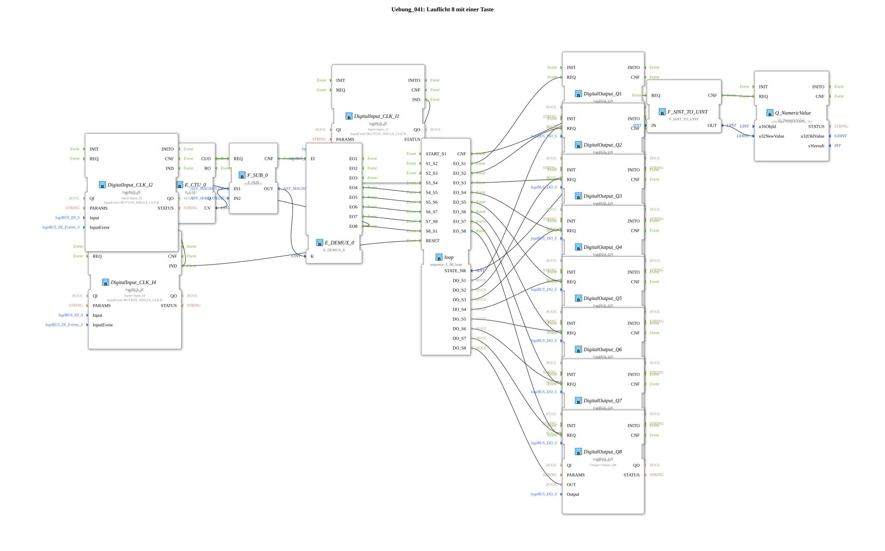

# Exercise_041: 8-Step Sequence with One Button

[(https://notebooklm.google.com/notebook/a6872e59-1dfc-4132-a118-aff1bc7bc944)
This article describes the logiBUS® exercise `Uebung_041`. Here, the manual control of an 8-step sequence is reduced to a single button.
----
## Objective of the Exercise

Optimization of the operating logic from Exercise 040. It demonstrates how, by combining a counter (`E_CTU`) and a demultiplexer (`E_DEMUX_8`), all phases of a sequence can be cycled through sequentially with just a single button.

-----

## Description and Components

[cite_start]In `Uebung_041.SUB`, a central event path is used to control the sequencer `sequence_E_08_loop`[cite: 1].

### Function Blocks (FBs)

- **`I1` (Start)**: Sets the sequence to the first step.
- **`I2` (Step)**: The only button for advancing.
- **`E_CTU_0`**: Counts the clicks on `I2`.
- **`E_DEMUX_0`**: Forwards the click event to the appropriate transition input of the step sequence based on the counter value.
- **`I4` (Reset)**: Clears both the step sequence and the counter.

-----

## Functionality

1. **Initialization**: A click on **I1** starts the scrolling light at `Q1`.
2. **Manual Iteration**: Each click on **I2** increments the internal counter. The demultiplexer ensures that the first event goes to `S1_S2`, the second to `S2_S3`, and so on.
3. **Overflow**: After the
8th step, the logic automatically resets and starts again from the beginning (with the next click).

This enables complete process control with minimal hardware requirements.

-----

## Application Example

**Sequential Menu Navigation**:

A single button on the joystick is used to cycle through 8 different operating modes. Each press advances one level and activates the corresponding actuator or parameter set.

---

### 🌐 Related topic subpages on ms-muc-docs.de

- [🌐 E_CTU Event Counter module on ms-muc-docs.de](https://www.ms-muc-docs.de/iec-61499/event-function-blocks/e_ctu/)

]
