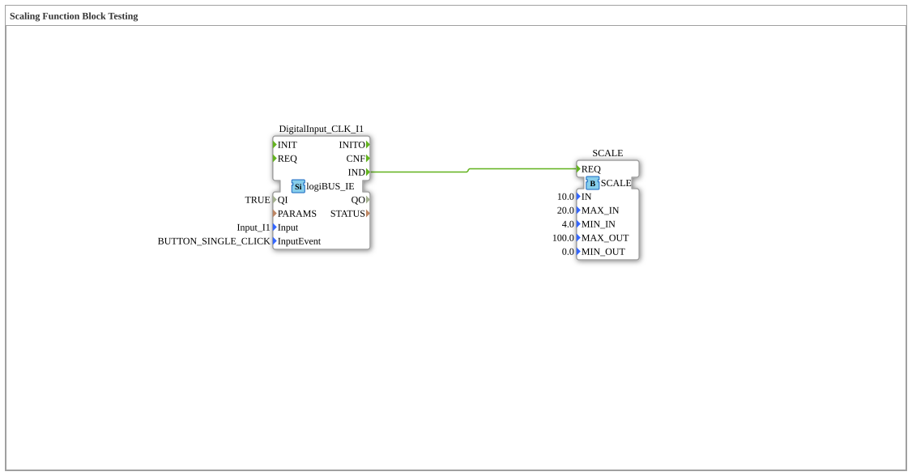

# Exercise_042: Scaling Function Block Testing

This article describes the logiBUS® exercise `Uebung_042`. It demonstrates the mathematical conversion of value ranges.

----

## Objective of the Exercise

Using the function block `SCALE`. In automation technology, raw values (e.g., 4-20 mA) often need to be converted into physical quantities (e.g., 0-10 bar). The Scale function block performs this linear conversion.

-----

## Description and Components

[cite_start]In `Uebung_042.SUB`, a test scenario for the Scaling function block is set up[cite: 1].

### Function Blocks (FBs)

* **`SCALE`**: The conversion block.

* **Parameters**:

* `MIN_IN` / `MAX_IN`: The source range (here 4.0 to 20.0).

* `MIN_OUT` / `MAX_OUT`: The target range (here 0.0 to 100.0).

* `IN`: The current input value (here fixed at 10.0).

-----

## Functionality

As soon as the event `REQ` (triggered here by button **I1**) occurs, the function block calculates the position of the input value in the source range and maps it proportionally to the target range.

At `IN = 10.0` (exactly halfway between 4 and 20, it's not quite, but mathematically defined), the function block outputs the corresponding result.

----

## Application Example

**Sensor Calibration**:

A pressure sensor delivers values between 400 (vacuum) and 2000 (maximum pressure). For display on the terminal, this should be shown as 0% to 100%. The `SCALE` function block handles this task, allowing the logic to always work with intuitive percentage values.