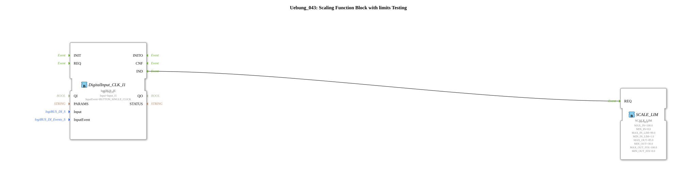

# Exercise_043: Scaling Function Block with Limits Testing

This article describes the logiBUS® exercise `Uebung_043`. This is an extension of the scaling function to include safety limits.

----

## Objective of the Exercise

Using the function block `SCALE_LIM`. Unlike the simpler `SCALE`, this block offers additional parameters to limit the result both upwards and downwards, even if the input value exceeds the defined range.

-----

## Description and Components

[cite_start]In `Uebung_043.SUB`, a highly complex scaling scenario with fixed limits is set up[cite: 1].

### Function Blocks (FBs)

* **`SCALE_LIM`**: Scaling with saturation.

* **Parameters**:

* `MIN_IN_LIM` / `MAX_IN_LIM`: Define the range in which the input value is "valid".

* `MIN_OUT_FIX` / `MAX_OUT_FIX`: Hard limits for the output. No matter what is calculated, the output will never fall below or exceed these values.

-----

## Application Example

**Overflow Protection in Valve Control**:

A controller calculates the opening of a valve based on the temperature. Even if the controller requests "150%" due to an extreme disturbance, `SCALE_LIM` ensures that the actual output value is capped at 100% to prevent damage to the hardware. Similarly, a minimum opening (e.g., 5% for cooling) can be permanently set as a lower limit.