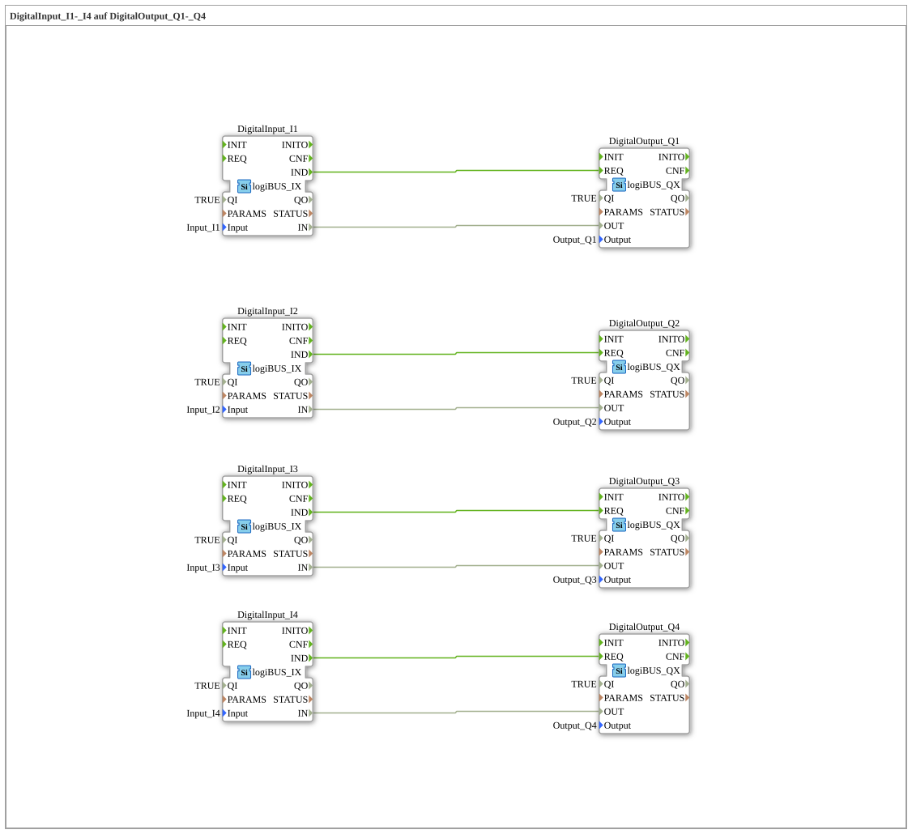

# Exercise_049: DigitalInput_I1-_I4 to DigitalOutput_Q1-_Q4

This article describes the logiBUS® exercise `Uebung_049`. This exercise is designed to practice creating extensive point-to-point connections.

## 🎧 Podcast

* [4diac IDE: How the IEC 61499 Standard is Revolutionizing Industrial Automation ](https://podcasters.spotify.com/pod/show/eclipse-4diac-de/episodes/4diac-IDE-Wie-der-IEC-61499-Standard-die-Industrieautomatisierung-revolutioniert-e36756a)

* [IEC 61499 vs. 61131: Do We Need a New Standard for IIoT? Analysis of a heated debate about distributed intelligence

* [IEC 61499: Does the new standard liberate industrial automation?] A comparison with IEC 61499 and the bridge between OT & IT.

* [IEC 61499: Revolutionizing industrial automation – Why the new standard makes your systems future-proof

* [4diac IDE: Your open-source toolkit for distributed industrial automation according to IEC 61499

----

## Overview

[cite_start]In IEC 61499, four digital inputs (QZMsdocsQZ to QZMsdocsQZ) are directly mapped to four digital outputs (QZMsdocsQZ to QZMsdocsQZ)[cite: 1]. This is the basic form of signal routing without logic or structuring, where each channel has its own event and data connections. It primarily serves as training for manual wiring in the 4diac IDE.

---

### 🌐 Related topic subpages on ms-muc-docs.de

* [🌐 Eclipse 4diac IDE & Color Reference on ms-muc-docs.de](https://www.ms-muc-docs.de/iec-61499/eclipse-4diac/)

]