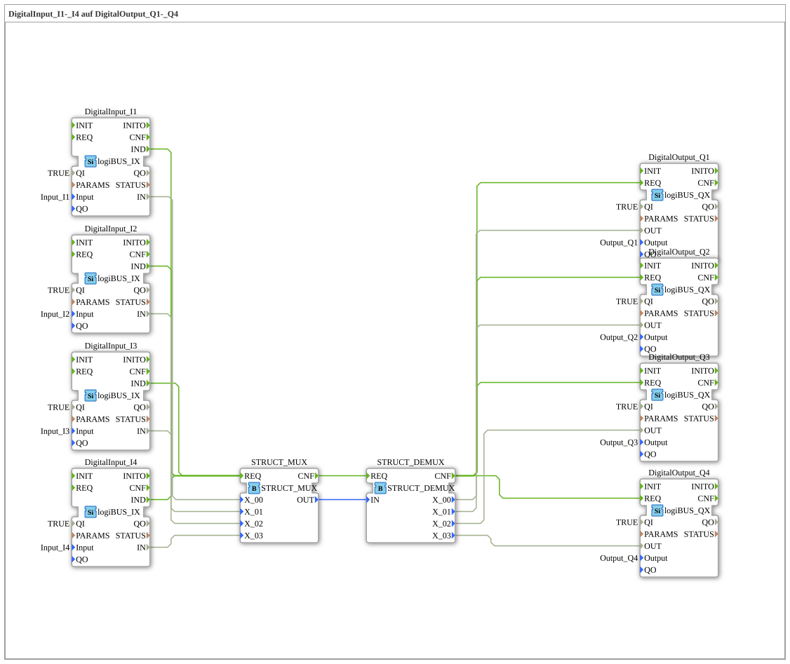

# Exercise_051: DigitalInput_I1-_I4 to DigitalOutput_Q1-_Q4

This article describes the logiBUS® exercise `Uebung_051`. It demonstrates how to combine many individual signals into a single packet (structure) to route them more efficiently through the program.
## 🎧 Podcast

* [Automation Decoded: Guiding, Controlling, Regulating – The Invisible Language of Technology (DIN IEC 60050-351)](https://podcasters.spotify.com/pod/show/ms-muc-lama/episodes/Automatisierung-entschlsselt-Leiten--Steuern--Regeln--Die-unsichtbare-Sprache-der-Technik-DIN-IEC-60050-351-e36t52b)
* [Infineon CAN Transceiver TLE9250V versus TLE9351VSJ](https://podcasters.spotify.com/pod/show/ms-muc-lama/episodes/Infineon-CAN-Transceiver-TLE9250V-versus-TLE9351VSJ-e3b8nan)
* [Infineon TLE9351VSJ: The Invisible Car Bodyguard](https://podcasters.spotify.com/pod/show/ms-muc-lama/episodes/Infineon-TLE9351VSJ-der-unsichtbare-Auto-Bodyguard-e3b8nhl)
* [Agriculture and Forestry 4.0: The Foundation of Safety – Analysis of DIN EN ISO 25119-1 and the ](https://podcasters.spotify.com/pod/show/ms-muc-lama/episodes/Land--und-Forstwirtschaft-4-0-Das-Fundament-der-Sicherheit--Analyse-der-DIN-EN-ISO-25119-1-und-der-e39kn2f)

----

## Objective of the Exercise

Use of `STRUCT_MUX` and `STRUCT_DEMUX`. In large systems, it's impractical to run hundreds of individual cables. Instead, signals are bundled ("multiplexed"), transmitted over a single connection, and then unpacked at the destination.

-----

## Description and Components

[cite_start]The subapplication `Uebung_051.SUB` uses structured data types for signal transmission[cite: 1].

### Function Blocks (FBs)
* **`STRUCT_MUX`**: Packs 4 individual digital signals into a structured data type (here `ST04X`).
* **`STRUCT_DEMUX`**: Extracts the 4 individual signals from the structure.

-----

## Functionality

1. The four pushbuttons send their signals to inputs `X_00` to `X_03` of the MUX.

2. A click on any pushbutton triggers input `REQ` of the MUX.

3. The MUX creates a data packet (`OUT`) containing all four states simultaneously.

4. This packet is transmitted to the DEMUX via a single data connection.

5. The DEMUX parses the packet and controls the four lamps `Q1` to `Q4`.

This significantly reduces the number of connection lines in the main program and improves clarity.

-----

## Application Example

**Wiring Harness Abstraction**:

Imagine 16 sensors at the rear of a machine need to be routed to the cab. In the software, these 16 signals at the rear are grouped into a structure called "Rear_Sensors". Only this single structure is passed through the program logic to the cab view, where it is then broken down into individual values for the display.
