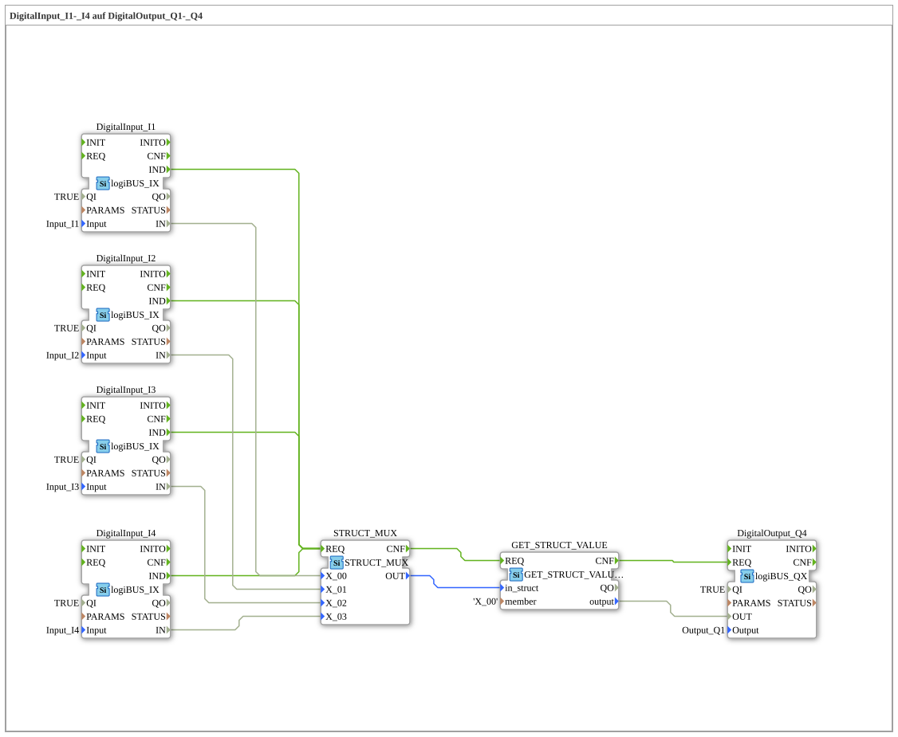

# Exercise_052: DigitalInput_I1-_I4 to DigitalOutput_Q1-_Q4

This article describes the logiBUS® exercise `Uebung_052`.
----
## Overview
[cite_start]This variant demonstrates how to extract a single signal from a structure without having to unpack all channels[cite: 1].

Using the function block `GET_STRUCT_VALUE` and the parameter `member = 'X_00'`, only the first channel from the data packet of exercise 051 is specifically tapped and routed to the output `Q4`. This is useful when a module only needs specific information from a large data bundle.

[cite_start]This variant demonstrates how to extract a single signal from a structure without having to unpack all channels.[cite: 1]

Using the function block `GET_STRUCT_VALUE` and the parameter `member = 'X_00'`, only the first channel from the data packet of exercise 051 is selectively tapped and routed to the output `Q4`. This is useful when only specific information from a large data bundle is needed in a module.

[cite_start] 
