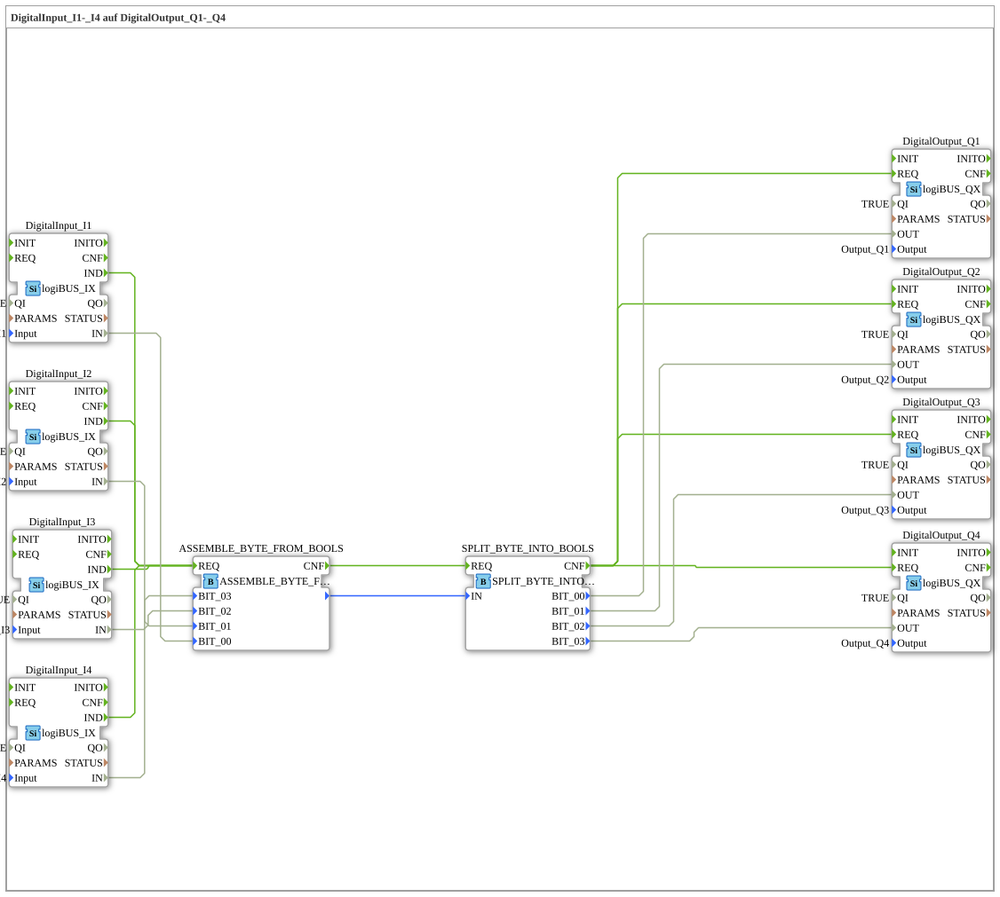

# Exercise_053: DigitalInput_I1-_I4 to DigitalOutput_Q1-_Q4

This article describes the logiBUS® exercise `Uebung_053`.
----
## Purpose of the Exercise
Combining bits into a byte. This is a low-level form of data bundling, often used in communication with fieldbus devices (e.g., CAN bus messages).

-----

## Description and Components

[cite_start]The subapplication `Uebung_053.SUB` uses conversion blocks for the data type `BYTE`[cite: 1].

### Function Blocks (FBs)

* **`ASSEMBLE_BYTE_FROM_BOOLS`**: Converts 8 individual bits (4 are used here) into an 8-bit integer value (BYTE).
* **`SPLIT_BYTE_INTO_BOOLS`**: Decomposes the byte back into its individual bits.

-----

## Functionality

The principle is the same as in Exercise 051, however, instead of a software structure, a standardized numeric data type (`BYTE`) is used as a container. This is the most efficient form of data transmission, as it minimizes network memory consumption.