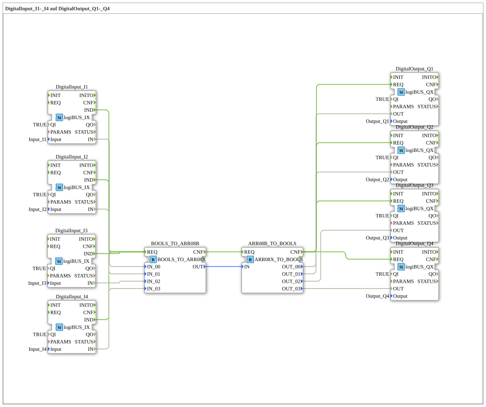

# Exercise_054: DigitalInput_I1-_I4 to DigitalOutput_Q1-_Q4

This article describes the logiBUS® exercise `Uebung_054`. This is the third method of signal bundling: the use of arrays.
----
## Objective of the Exercise
Using `BOOLS_TO_ARR08X` and `ARR08X_TO_BOOLS`.

-----

## Description

[cite_start]In `Uebung_054.SUB`, four digital signals are packaged into an array (an indexed list of values)[cite: 1].

[cite_start] Unlike a structure (where each channel has a name, e.g., `X_00`), an array accesses data by its position (index 0 to 7). This is particularly advantageous when processing signal paths in program loops.

