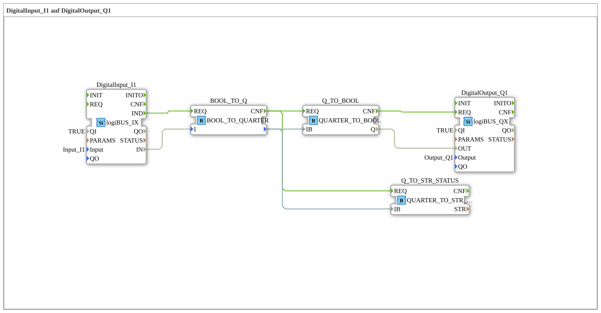

# Exercise_055: DigitalInput_I1 to DigitalOutput_Q1

[(https://notebooklm.google.com/notebook/a6872e59-1dfc-4132-a118-aff1bc7bc944)
This article describes the logiBUS® exercise `Uebung_055`. It introduces a key logiBUS concept for transmitting extended status information: the "Quarter" (2-bit information).
----
## Objective of the Exercise

Understanding extended signal states. In professional control systems, a simple "On/Off" is often insufficient. It's also necessary to know whether a signal is invalid or if an error has occurred. A "Quarter" uses 2 bits per channel to represent four states (e.g., Off, On, Error, Not Available).

-----

## Description and Components

[cite_start]The subapplication `Uebung_055.SUB` demonstrates the conversion between simple Boolean values and logiBUS quarters[cite: 1].

### Function Blocks (FBs)

- **`BOOL_TO_Q`**: Converts a standard bit into a 2-bit quarter.
- **`Q_TO_BOOL`**: Extracts the main signal (On/Off) from the quarter.
- **`QUARTER_TO_STR_STATUS`**: Converts the 2-bit code into readable text (e.g., "STATUS_OFF", "STATUS_ON").

-----

## Functionality

The system enriches the information as follows:

1. The button `I1` delivers a simple `TRUE/FALSE`.
2. `BOOL_TO_Q` converts this into a quarter (e.g., FALSE ➡️ 00, TRUE ➡️ 01).
3. This packet (`QB`) can now be processed by the program.
4. Finally, it is broken down again: The lamp `Q1` receives only the on/off bit, while a diagnostic module simultaneously determines the text status ("ON").

This forms the basis for modern diagnostic systems in agricultural technology.
