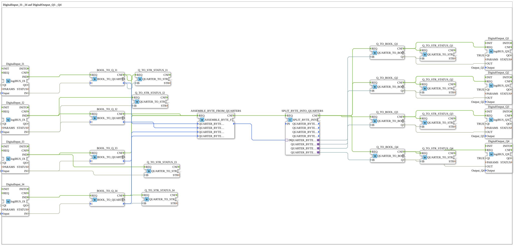

# Exercise_056: DigitalInput_I1-_I4 to DigitalOutput_Q1-_Q4

[(https://notebooklm.google.com/notebook/a6872e59-1dfc-4132-a118-aff1bc7bc944)
This article describes the logiBUS® exercise `Uebung_056`. Here, the quarter concept is extended to a four-channel structure
----

## Overview

[cite_start]The sub-application `Uebung_056.SUB` shows a complete diagnostic pipeline[cite: 1]:

1. **Input**: Four pushbuttons (`I1`-`I4`) are converted into quarters.
2. **Bundling**: Four quarters (4 x 2 bits = 8 bits) are combined into a single byte using the function block `ASSEMBLE_BYTE_FROM_QUARTERS`.
3. **Transport**: The byte is transmitted as a packet.
4. **Decomposition**: `SPLIT_BYTE_INTO_QUARTERS` recovers the information.
5. **Output & Diagnostics**: The signals control four lamps, while a plaintext status for the terminal is generated for **each** channel.

This is the standard procedure for transmitting section states (e.g., in a field sprayer) in the logiBUS system.
