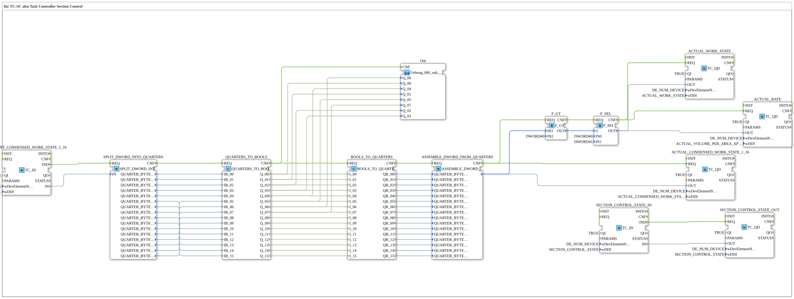

# Exercise_060: for TC-SC, i.e., Task Controller Section Control

This article describes the logiBUS® exercise `Uebung_060`. This is a high-level exercise for professional ISOBUS applications in the field of precision farming.
## 🎧 Podcast

* [Automation Decoded: Controlling, Steering, Regulating – The Invisible Language of Technology (DIN IEC 60050-351)](https://podcasters.spotify.com/pod/show/ms-muc-lama/episodes/Automatisierung-entschlsselt-Leiten--Steuern--Regeln--Die-unsichtbare-Sprache-der-Technik-DIN-IEC-60050-351-e36t52b)

----

## Objective of the Exercise

Connection to an ISOBUS Task Controller (TC). It demonstrates how automatic section control and the documentation of working states and application rates are implemented.

-----

## Description and Components

[cite_start]In `Uebung_060.SUB`, setpoint values are received from the Task Controller and actual values are reported back.[cite: 1]

### Function Blocks (FBs)
* **`TC_ID`**: Receives commands from the tractor's Task Controller (e.g., "Activate section 5").
* **`TC_QD`**: Reports data back to the Task Controller (e.g., "Section 5 is now active").
* **Quarter Logic**: The section states are transmitted as quarters (2-bit) to also report error states (e.g., a broken wire at the valve) to the Task Controller.
* * **DDI (Data Dictionary Identifier)**: Specific codes (e.g., `SETPOINT_CONDENSED_WORK_STATE`) that define which information is currently being transmitted.

-----

## Functionality

1. **Setpoint Reception**: The Task Controller sends a DWORD containing the states of 16 section widths.

2. **Processing**: The controller decomposes this DWORD into individual quarters and then into Boolean signals for the valves (SubApp `Out`).

3. **Actual Value Feedback**: The actual states of the valves are reassembled into a DWORD and sent back to the Task Controller as the "Actual Condensed Work State."

4. **Work Status**: As soon as at least one boom section is active (`F_GT`), the controller reports the "Actual Work State" (work in progress) to the Task Controller, whereupon the Task Controller begins recording the area.

-----

## Application Example

**Automatic boom section control on a sprayer**:

The tractor detects via GPS that part of the boom is moving over an area that has already been treated. The Task Controller sends the command "Breed Sections 1-4 OFF". The logiBUS program receives this command, switches off the physical solenoid valves, and confirms the success to the operator on the screen by displaying the correct current status.