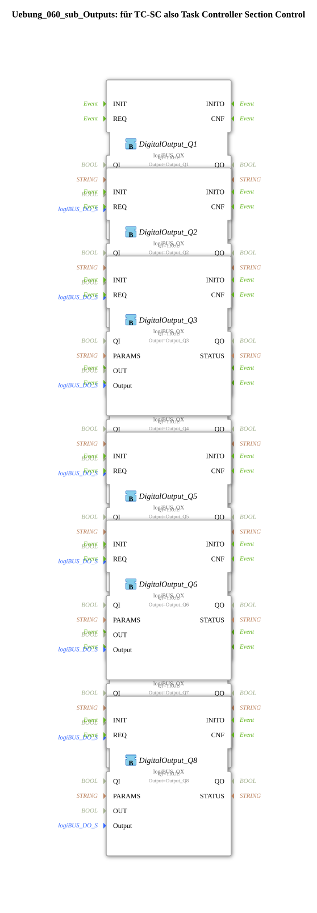

Here is the documentation for exercise `Uebung_060_sub_Outputs` based on the provided XML data.
# Exercise_060_sub_Outputs: for TC-SC, i.e., Task Controller Section Control

* * * * * * * * * *
## Introduction
The sub-application **Exercise_060_sub_Outputs** serves as an abstraction layer for the hardware outputs. According to the internal comment, this function block is intended for "TC-SC" (Task Controller Section Control). It receives logical Boolean signals and forwards them to physical or logical LogiBUS outputs (Digital Outputs).

The function block maps a series of input variables (`Q_00` to `Q_08`) to specific output addresses.

## Function Blocks (FBs) Used

This sub-application uses multiple instances of the same block type to control the various digital outputs.

### Sub-Blocks: DigitalOutput_Q1 to DigitalOutput_Q8

There are 8 instances of this driver type on the network that forward the signals to the hardware. Since the structure is identical for all instances (except for the assigned output), they are described together here.

### Sub-Blocks: DigitalOutput_Q1 to DigitalOutput_Q8

### Sub-Blocks: DigitalOutput_Q1 to DigitalOutput_Q8

### Sub-Blocks: DigitalOutput_Q1 to DigitalOutput_Q8

### Sub-Blocks: DigitalOutput_Q8 ... There are 8 instances of this driver type on the network that forward the signals to the hardware. ### Since the structure is identical for all instances (except for the assigned output), they are described together here.

### Sub-Blocks: DigitalOutput_Q1 to DigitalOutput_Q8
### Sub-Blocks: DigitalOutput_Q8
### Sub-Blocks: DigitalOutput_Q8
### Sub-Blocks: DigitalOutput_Q8
### Sub-Blocks: DigitalOutput_Q8
### Sub-Blocks: DigitalOutput_Q8
### Sub-Blocks: DigitalOutput_Q8
### Sub - **Type**: `logiBUS::io::DQ::logiBUS_QX`
- **Internal Function Blocks Used**:
- **DigitalOutput_Q1 to DigitalOutput_Q8**: `logiBUS::io::DQ::logiBUS_QX`
- **Parameters**:
- `QI`: `TRUE` (Block is permanently enabled)
- `Output`: Corresponds to the respective hardware output (e.g., `Output_Q1` for instance Q1, `Output_Q2` for instance Q2, etc.)
- **Event Input**: `REQ` (Triggered by the external event `CNF`)
- **Data Input**: `OUT` (Connected to external inputs `Q_00` to `Q_07`)
- **Functionality**:

These function blocks act as drivers for the LogiBUS system. As soon as an event arrives at input `REQ`, the value present at data input `OUT` is written to the configured physical output (`Output` parameter).

## Program Flow and Connections

The flow within the sub-application is purely event-driven and serves for direct signal routing (mapping).

1. **Event Handling (`CNF`)**:

* The main event `CNF` (Confirmation) at the input of the sub-application triggers the `REQ` input of all 8 included DigitalOutput blocks (`DigitalOutput_Q1` to `DigitalOutput_Q8`).
* This ensures that all outputs are updated in the same cycle.

2. **Data Mapping**:

The input variables are mapped to the outputs with an index offset:

* Input `Q_00` controls `DigitalOutput_Q1` (Output 1).
* * Input `Q_01` controls `DigitalOutput_Q2` (Output 2).
* Input `Q_02` controls `DigitalOutput_Q3` (Output 3).
* Input `Q_03` controls `DigitalOutput_Q4` (Output 4).
* Input `Q_04` controls `DigitalOutput_Q5` (Output 5).
* Input `Q_05` controls `DigitalOutput_Q6` (Output 6).
* Input `Q_06` controls `DigitalOutput_Q7` (Output 7).
* Input `Q_07` controls `DigitalOutput_Q8` (output 8).

*Note:* The variable `Q_08` is defined in the interface, but according to the current configuration, it is not linked to the internal network.

## Summary

The `Uebung_060_sub_Outputs` is an interface component that enables a clean separation between the control logic and the hardware connection. It receives eight control signals (`Q_00` - `Q_07`) and maps them to LogiBUS outputs 1 through 8. This facilitates code reuse and improves clarity when controlling sectors (Section Control).

## 🛠️ Related exercises
* [Uebung_060](Uebung_060.md)

