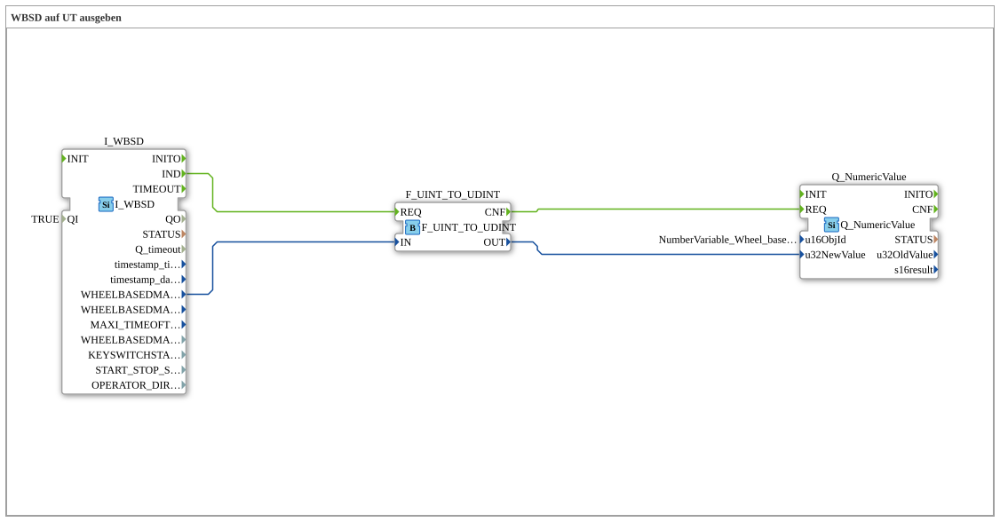

# Exercise_070: Outputting WBSD to UT

[(https://notebooklm.google.com/notebook/a6872e59-1dfc-4132-a118-aff1bc7bc944)
This article describes the logiBUS® exercise `Uebung_070`. It demonstrates how to read data from the tractor ECU (TECU) and visualize it on the terminal.
## 🎧 Podcast

- [The BTS7030-2EPA Intelligent Car Power Monitor ](https://podcasters.spotify.com/pod/show/ms-muc-lama/episodes/Der-BTS7030-2EPA-intelligenter-Auto-Stromwchter-e3b8n3s)
- [The Intelligent Circuit Breaker: How the Infineon BTS7030 Replaces Relays and Fuses in Cars ](https://podcasters.spotify.com/pod/show/ms-muc-lama/episodes/Der-Intelligente-Leistungsschalter-Wie-der-Infineon-BTS7030-Relais-und-Sicherungen-im-Auto-ersetzt-e39av14)
- [Infineon BTS7030-2EPA: Intelligent High-Side Circuit Breaker ](https://podcasters.spotify.com/pod/show/ms-muc-lama/episodes/Infineon-BTS7030-2EPA-Intelligenter-High-Side-Leistungsschalter-e368fl3)
- [JBC Soldering Tips C470 vs. C245 vs. C210 vs. C115: Which Tip is the All-Rounder and When Do You Need the Nano Specialist? ](https://podcasters.spotify.com/pod/show/ms-muc-lama/episodes/JBC-Ltspitzen-C470-vs--C245-vs--C210-vs--C115-Welche-Spitze-ist-der-Allrounder-und-wann-brauchst-du-den-Nano-Spezialisten-e39ak58)
- [Reverse Polarity Protection in Electronics: Why the Ideal Diode (LM74700) MOSFETs and Schottky Diodes in Efficiency and Cost ](https://podcasters.spotify.com/pod/show/ms-muc-lama/episodes/Verpolungsschutz-in-der-Elektronik-Warum-die-ideale-Diode-LM74700-MOSFETs-und-Schottky-Dioden-in-Effizienz-und-Kosten-schlgt-e3a2487)

----

## Exercise Objective

Using the function block `I_WBSD` (Wheel Based Speed and Distance). The objective is to retrieve the speed reported by the tractor's transmission or wheels and send it as a numerical value to an ISOBUS terminal.

-----

## Description and Components

[cite_start]The subapplication `Uebung_070.SUB` reads the ISOBUS message WBSD and forwards it to a numerical display[cite: 1].

### Function Blocks (FBs)

- **`I_WBSD`**: Type `isobus::tecu::I_WBSD`. [cite_start]This module listens on the CAN bus for the standardized TECU messages for wheel-based speed and distance[cite: 1].
- **`Q_NumericValue`**: Sends the value to the object `NumberVariable_Wheel_based_machine_speed` in the terminal pool.

-----

## Functionality

The TECU sends the speed data to the ISOBUS at fixed time intervals (cyclically).

1. The module `I_WBSD` receives a new message.
2. It updates the output `WHEELBASEDMACHINESPEED` and fires a `IND` event.
3. The event triggers the display on the terminal.
4. The driver sees the tractor's current speed in real time on their display.

-----

## Application Example

**Monitoring Driving Speed**:

When spreading liquid manure or fertilizer, precise speed control is crucial for accurate application. The display on the terminal helps the driver monitor whether they are operating within the optimal speed range.

--

### 🌐 Related Topic Subpages on ms-muc-docs.de

- [🌐 Interactive JBC Soldering Tip Guide & Infographic on ms-muc-docs.de](https://www.ms-muc-docs.de/elektrotechnik/werkzeug/lötkolben/jbc-lötspitzen-übersicht/)
- [🌐 Diode & Semiconductor Basics on ms-muc-docs.de](https://www.ms-muc-docs.de/elektrotechnik/elektronik-i/diode/diode/)
