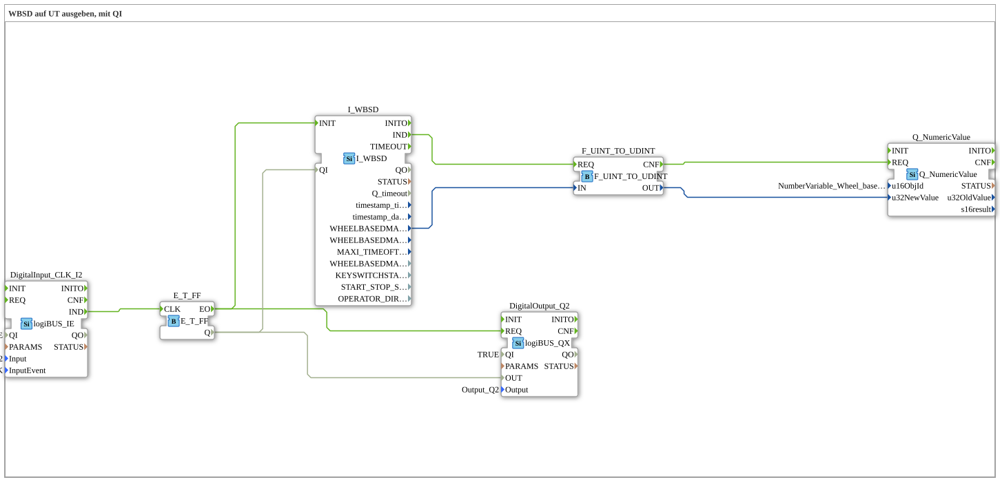

# Exercise_070b: Outputting WBSD to UT with QI

* * * * * * * * * *

## Introduction

This exercise demonstrates the output of the wheel-based machine speed (WBSD) to an ISOBUS Universal Terminal (UT). The qualifier input **QI** of the WBSD block is controlled by a T flip-flop, which is toggled by a digital input (button I2). The current speed value is output via the UT block **Q_NumericValue**.

## Function Blocks (FBs) Used

- **I_WBSD**
- Type: `isobus::tecu::I_WBSD`
- Provides the wheel-based machine speed as a 16-bit value.

– Events: `IND` (Output), `INIT` (Input)

– Data: `WHEELBASEDMACHINESPEED` (Output), `QI` (Input)

- **Q_NumericValue**

– Type: `isobus::UT::Q::Q_NumericValue`

– Displays a numeric value on the UT.

– Parameters: `u16ObjId` = `NumberVariable_Wheel_based_machine_speed`

– Events: `REQ` (Input)

– Data: `u32NewValue` (Input)

– **F_UINT_TO_UDINT**

– Type: `iec61131::conversion::F_UINT_TO_UDINT`

– Converts a 16-bit value to a 32-bit value.

– Events: `REQ` (input), `CNF` (output)

– Data: `IN` (input), `OUT` (output)

- **E_T_FF**

– Type: `iec61499::events::E_T_FF`

– T-Flip-flop: The output state is toggled on each rising edge of the clock input.

– Events: `CLK` (Input), `EO` (Output)

– Data: `Q` (Output)

- **DigitalInput_CLK_I2**
- Type: `logiBUS::io::DI::logiBUS_IE`
- Digital input (I2) with event triggering on button press (BUTTON_SINGLE_CLICK).

– Parameters: `QI` = `TRUE`, `Input` = `Input_I2`, `InputEvent` = `BUTTON_SINGLE_CLICK`

– Events: `IND` (Output)

- **DigitalOutput_Q2**

– Type: `logiBUS::io::DQ::logiBUS_QX`

– Digital Output (Q2)

– Parameters: `QI` = `TRUE`, `Output` = `Output_Q2`

– Events: `REQ` (Input)

– Data: `OUT` (Input)

## Program Flow and Connections

1. **Input Signal**: The digital input **I2** is used as a push button. A single click triggers the function block `DigitalInput_CLK_I2` to generate an event `IND`.
2. **T Flip-Flop**: This event is sent to the clock input `CLK` of the **E_T_FF**. Each time a key is pressed, the output `Q` toggles its state.
3. **Control of WBSD and Output Q2**:

- The flip-flop output `Q` is connected to the qualifier input `QI` of **I_WBSD** and to the data input `OUT` of the digital output **DigitalOutput_Q2**.
- When the flip-flop changes state, the event `EO` is triggered simultaneously, which initializes **I_WBSD** (`INIT`) and updates the digital output (`REQ`).
1. **Value Output**:

- The initialized **I_WBSD** outputs the current speed (16-bit) via `WHEELBASEDMACHINESPEED`.
- This value is converted to a 32-bit value in the **F_UINT_TO_UDINT** function block.
- The converter's acknowledgment event `CNF` triggers the **Q_NumericValue** (`REQ`), which takes the converted value (`u32NewValue`) and displays it on the UT.

This exercise thus illustrates the combined use of hardware input, flip-flop logic, and ISOBUS communication for acquiring and displaying a machine parameter.

## Summary

Exercise **Exercise_070b** demonstrates how a digital push button (I2) is used to control the enable (QI) of the wheel-based speed via a T flip-flop. The measured speed is displayed on an ISOBUS universal terminal. The setup is consistent with the principle of Exercise **Exercise_094a**. Understanding this circuit is fundamental for applications where machine data needs to be output cyclically or in response to events.
