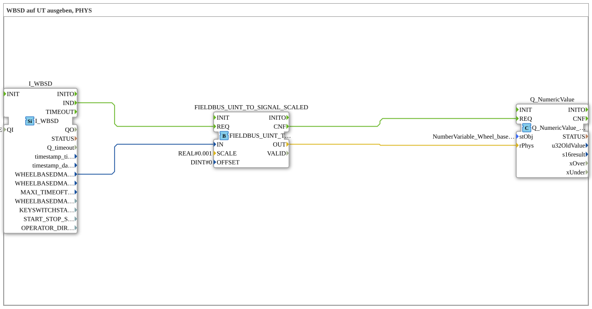

# Exercise_070c: Outputting WBSD to UT, PHYS

* * * * * * * * * *
## Introduction

This exercise demonstrates how to read the wheel-based machine speed (WBSD) from a fieldbus, convert it into a physical value, and display it as a numerical value on a Universal Terminal (UT).
The raw integer value (UINT) is converted into a real numerical value (e.g., m/s) using scaling and then transmitted to the UT.

* * * * * * * * * *
## Function Blocks (FBs) Used

### Sub-Blocks: I_WBSD

- **Type**: `isobus::tecu::I_WBSD`
- **Internal FBs Used**: (none)
- **Parameters**:
- `QI` = `TRUE` (activates the block)
- **Event Output/Input**:
- Event output `IND` – reports a new valid value
- **Data Output/Input**:
- Data output `WHEELBASEDMACHINESPEED` (UINT) – raw value of the wheel speed
- **Functionality**:

The block reads the current value of the wheel-based machine speed (WBSD) via the ISOBUS fieldbus. The event `IND` is triggered when a new, valid measurement is obtained.

### Sub-Blocks: FIELDBUS_UINT_TO_SIGNAL_SCALED

- **Type**: `logiBUS::signalprocessing::fieldbus::FIELDBUS_UINT_TO_SIGNAL_SCALED`
- **Internal Function Blocks Used**: (none)
- **Parameters**:
- `SCALE` = `0.001`
- `OFFSET` = `0`
- **Event Input/Output**:
- Event input `REQ` – starts the conversion
- Event output `CNF` – confirms completion
- **Data Input/Output**:
- Data input `IN` (UINT) – raw value
- Data output `OUT` (REAL) – Converted Scaled Value
- **How it Works**:

This module converts an unsigned 16-bit integer (UINT) into a real number. The conversion formula is:

OUT = IN * SCALE + OFFSET`.

For example, mm/s is converted to m/s using `SCALE = 0.001` and `OFFSET = 0`.

### Sub-Blocks: Q_NumericValue

- **Type**: `isobus::UT::Q::Q_NumericValue_PHYS`
- **Internal Function Blocks Used**: (none)
- **Parameters**:
- `stObj` = `NumberVariable_Wheel_based_machine_speed` (reference to the object definition in the UT pool)
- **Event Input/Output**:
- Event input `REQ` – updates the value on the UT
- **Data Input/Output**:
- Data input `rPhys` (REAL) – physical value displayed on the UT
- **Functionality**:

The block displays the passed physical value (REAL) on the Universal Terminal via the ISOBUS UT standard. The specific representation (e.g., unit, decimal places) is determined by the object definition `NumberVariable_Wheel_based_machine_speed` referenced in the pool.

* * * * * * * * * *
## Program Flow and Connections

The three function blocks are linked in a cascade via event and data connections:

1. **Event Chain**

I_WBSD.IND` → `FIELDBUS_UINT_TO_SIGNAL_SCALED.REQ` → `FIELDBUS_UINT_TO_SIGNAL_SCALED.CNF` → `Q_NumericValue.REQ`

- The fieldbus block generates the event `IND` when a new wheel speed value is received, which triggers the conversion.
- After successful conversion, `CNF` signals the UT block to display the updated value.
2. **Data Flow**

I_WBSD.WHEELBASEDMACHINESPEED` → `FIELDBUS_UINT_TO_SIGNAL_SCALED.IN`

FIELDBUS_UINT_TO_SIGNAL_SCALED.OUT` → `Q_NumericValue.rPhys`

- The raw value (UINT) is passed directly to the converter.
- The scaled result (REAL) is passed to the UT block as a physical value.

**Learning Objectives**:

- Understanding the ISOBUS data interfaces for speed signals.
- Using a scaling block to convert integer values to physical values.
- Displaying process values on a Universal Terminal.

**Difficulty Level**: Advanced (Basic knowledge of ISOBUS and 4diac IDE required)

**Starting the Exercise**:
Import the SubApp into your 4diac project and integrate it into a suitable application (e.g., with an event-driven cycle). Ensure that the referenced UT object definition `NumberVariable_Wheel_based_machine_speed` is present in the corresponding pool.

* * * * * * * * * *
## Summary

Exercise **Exercise_070c** demonstrates a complete data path from fieldbus data acquisition (WBSD) through scaled conversion to display on a Universal Terminal. The use of standardized ISOBUS components enables easy integration into agricultural control systems and shows how physical values can be derived from raw bus data.

---

### 🌐 Related topic subpages on ms-muc-docs.de

- [🌐 Eclipse 4diac IDE & Color Reference on ms-muc-docs.de](https://www.ms-muc-docs.de/iec-61499/eclipse-4diac/)

]
