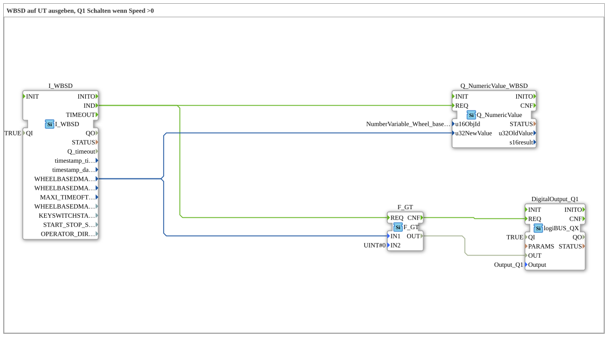

# Exercise_071: Output WBSD to UT, Switch Q1 when Speed > 0
[](https://notebooklm.google.com/notebook/a6872e59-1dfc-4132-a118-aff1bc7bc944)
This article describes the logiBUS® exercise `Uebung_071`. Here, the tractor speed is not only displayed but also used directly to control an actuator.
----
## Objective of the Exercise
Implementation of threshold logic based on TECU data. The output should be activated automatically as soon as the machine starts moving.

-----

## Description and Components

[cite_start]In `Uebung_071.SUB`, the wheel-based speed is compared to a fixed value[cite: 1].

### Function Blocks (FBs)



* **`I_WBSD`**: Returns the current speed.
* **`F_GT`**: A comparison block (Greater Than). It checks if the input value is greater than 0.
* **`DigitalOutput_Q1`**: The hardware output.

-----

## Functionality

The logic reacts to each speed message from the TECU:

1. `I_WBSD.IND` triggers the comparison `F_GT`.

2. If the speed is > 0, `F_GT.OUT` returns `TRUE`.

``` 3. The confirmation event `CNF` requests an update from output `Q1`.

Result: As soon as the tractor starts moving, output `Q1` is activated. If it comes to a stop (Speed = 0), the output is immediately deactivated.

-----

## Application Example

**Automatic Work Light**:

A reversing camera or auxiliary headlight should only be active when the machine is actually moving. This saves energy and prevents dazzling other road users when stationary.