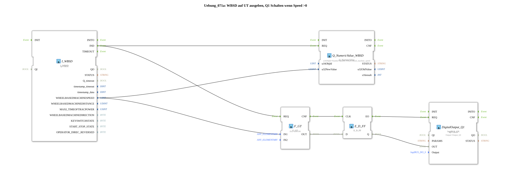

# Exercise_071a: Output WBSD to UT, Switch Q1 when Speed > 0

[(https://notebooklm.google.com/notebook/a6872e59-1dfc-4132-a118-aff1bc7bc944)
This article describes the logiBUS® exercise `Uebung_071a`.
----
## Overview

[cite_start]This variant of exercise 071 uses a D flip-flop (`E_D_FF`) for time synchronization of the switching signal[cite: 1].

The result of the speed comparison is only finalized and passed to the output `Q1` upon arrival of the confirmation event at the clock input of the flip-flop. This ensures more stable switching behavior in more complex logic networks by guaranteeing that data and events are processed in perfect sync.

[cite_start] 
