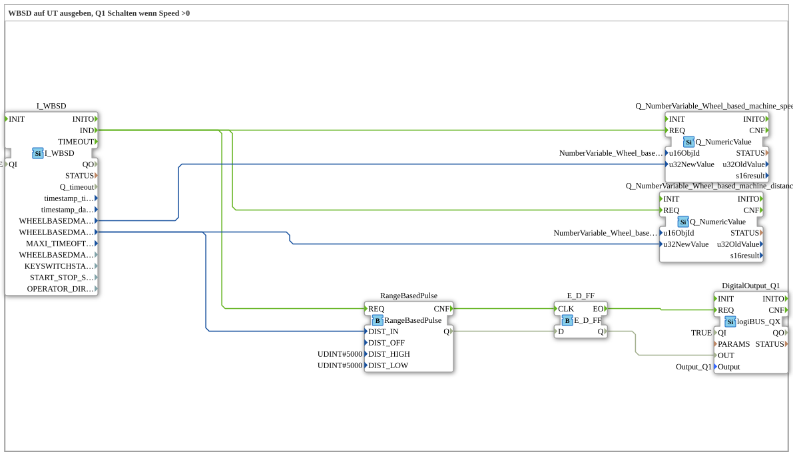

# Exercise_071b: Output WBSD to UT, Switch Q1 when Speed > 0

This article describes the logiBUS® exercise `Uebung_071b`. Here, we control an output not via speed, but via the distance traveled.
----
## Objective of the Exercise
Use of the function block `RangeBasedPulse`. It demonstrates how to generate a periodic pulse signal that is not time-dependent (every X seconds), but distance-dependent (every X meters).

-----

## Description and Components

[cite_start]The sub-application `Uebung_071b.SUB` reads the cumulative distance traveled by the tractor and generates pulses from it[cite: 1].

### Function Blocks (FBs)

* **`I_WBSD`**: Returns the value `WHEELBASEDMACHINEDISTANCE`.
* **`RangeBasedPulse`**: [cite_start]This block generates a level change at output `Q` as soon as a defined distance (here 5000 mm = 5 meters) has been exceeded[cite: 1].
* **`E_D_FF`**: Synchronizes the pulse for the hardware output.

-----

## Functionality

1. The tractor is moving. The distance value at block `I_WBSD` increases continuously.

2. `RangeBasedPulse` monitors this value.

3. The output of the module changes its state every 5 meters.

4. The lamp on `Q1` therefore flashes in rhythm with the distance traveled: 5m on, 5m off, 5m on...

-----

## Application Example

**Distance-Dependent Dosing**:

A seed drill is to mark a soil sample or emit a color signal every 10 meters. By linking this to the WBSD distance value, this marking always occurs at exactly the same interval, regardless of how fast or slow the tractor is traveling.