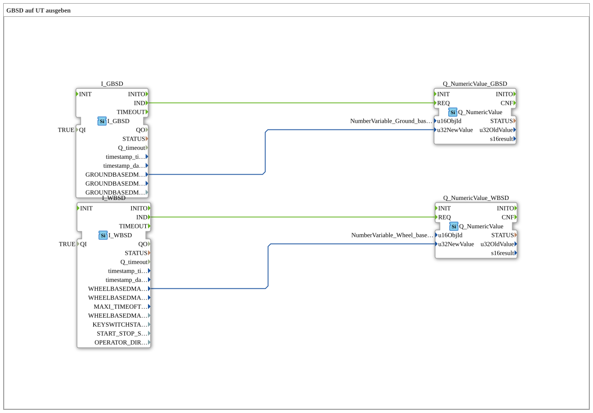

# Exercise_072: Outputting GBSD to UT

This article describes the logiBUS® exercise `Uebung_072`. In agricultural engineering, there are various sources for speed; here, the two most important ones are compared.
## 🎧 Podcast

* [Eclipse 4diac 3.0: ST Interpreter, FBE, and 7200 Commits – The Turbo for Distributed Automation ](https://podcasters.spotify.com/pod/show/eclipse-4diac-de/episodes/Eclipse-4diac-3-0-ST-Interpreter--FBE-und-7200-Commits--Der-Turbo-fr-verteilte-Automatisierung-e3a5cpl)

----

## Goal of the Exercise

Simultaneous processing of wheel-based (WBSD) and ground-based (GBSD) speed.

-----

## Description and Components

[cite_start]In `Uebung_072.SUB`, two different TECU input blocks are used and their values are displayed on the terminal[cite: 1].

### Function Blocks (FBs)

* **`I_WBSD`**: Wheel-based speed. This is usually derived from the transmission sensor.
* **`I_GBSD`**: Ground-based speed. This is usually determined via a radar sensor or GPS receiver.

-----

## Background: Why two values?

On loose surfaces (e.g., wet fields), the wheels often slip. The wheel-based speed is then higher than the actual forward motion. The ground-based speed (radar) is more accurate in this case. By comparing both values in the program, the controller can calculate the **slip** and adjust the work processes accordingly.

---

### 🌐 Related topic subpages on ms-muc-docs.de

* [🌐 Eclipse 4diac IDE & Color Reference on ms-muc-docs.de](https://www.ms-muc-docs.de/iec-61499/eclipse-4diac/)

]
