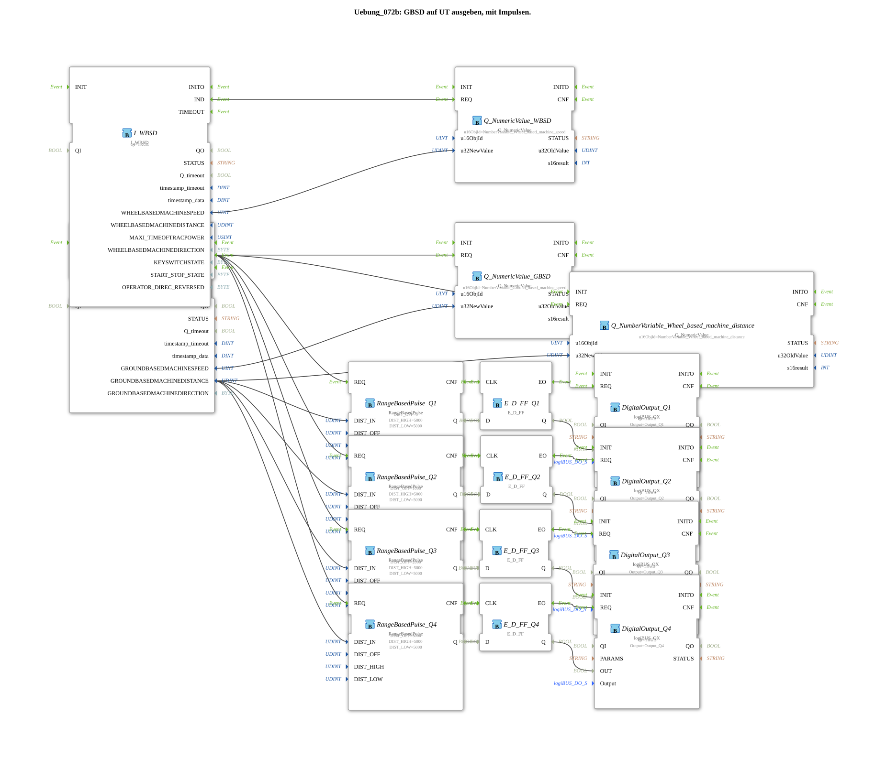

# Exercise_072b: Outputting GBSD to a UT with pulses.

This article describes the logiBUS® exercise `Uebung_072b`. Here, a complex position-dependent control system for multiple outputs is implemented.

----

## Objective of the Exercise

Generation of time-delayed pulses based on the GBSD distance value.

-----

## Description and Components

[cite_start]In `Uebung_072b.SUB`, four `RangeBasedPulse` function blocks control four outputs (`Q1` to `Q4`)[cite: 1].

### Functionality

All modules react to the same distance value from the radar (`I_GBSD`). However, they differ in the parameter **`DIST_OFF`** (offset):

* `Q1`: Offset 0 mm.

* `Q2`: Offset 1000 mm.

* `Q3`: Offset 2000 mm.

* `Q4`: Offset 3000 mm.

This creates a "wandering pattern": As the machine moves, the outputs switch on and off sequentially, each one meter offset from the distance traveled.

* `Q1`: Offset 0 mm.

* `Q2`: Offset 1000 mm.

* `Q3`: Offset 2000 mm.

* `Q4`: Offset 3000 mm.

This results in a "wandering pattern": As the machine moves, the outputs switch on and off sequentially, each one meter offset from the distance traveled.

* : Offset 0 mm ... -----

## Application Example

**Row Control on Seed Drills**:

The seeding units are mechanically offset on the frame. To begin sowing precisely on a line perpendicular to the direction of travel, the units must be activated with a time delay depending on the driving speed and position. The offset logic ensures that each unit is activated at exactly the right point in the field.