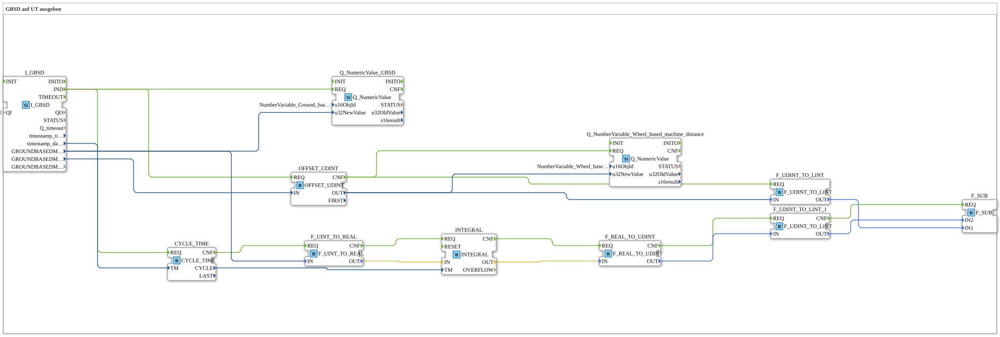

# Exercise_072c: Outputting GBSD to UT

[(https://notebooklm.google.com/notebook/a6872e59-1dfc-4132-a118-aff1bc7bc944)
This article describes the logiBUS® exercise `Uebung_072c`. It demonstrates a mathematical method for calculating the distance traveled from the speed (integration)
----

## Objective of the Exercise

Using the function block `INTEGRAL`. It demonstrates how to manually calculate a distance value if the TECU does not provide a cumulative distance value or if it needs to be reset for a partial measurement (trip odometer).

-----

## Description and Components

[cite_start]The sub-application `Uebung_072c.SUB` calculates the distance by integrating the radar-based speed over time[cite: 1].

### Function Blocks (FBs)

- **`I_GBSD`**: Returns the current speed.
- **`CYCLE_TIME`**: Measures the time between two speed messages (`TM`).
- **`INTEGRAL`**: Sums the product of speed and time (`v * dt`).
- **`OFFSET_UDINT`**: Allows adding a starting value or resetting the counter.

-----

## Functionality

The program continuously executes the basic physical formula `Weg = Geschwindigkeit * Zeit`. Since the TECU data is never perfectly smooth, the `INTEGRAL` block uses small time intervals (`CYCLE_TIME`) to achieve high accuracy in the summed distance. The result is displayed at the terminal as `Wheel_based_machine_distance` (even though it was calculated from radar data).
