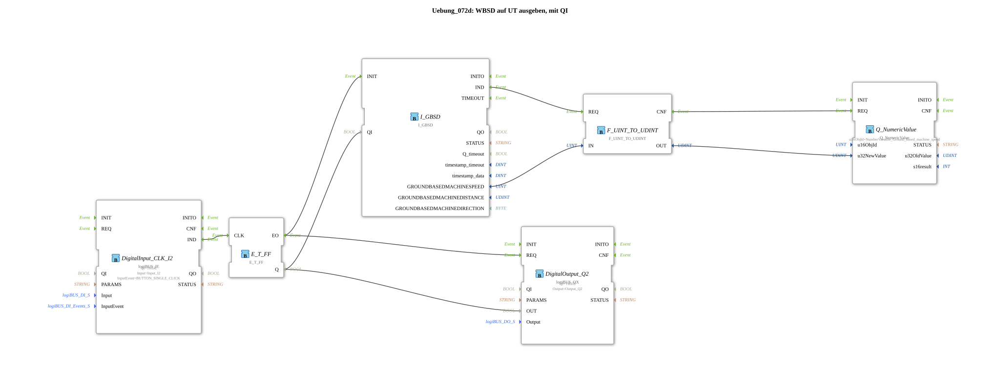

# Exercise_072d: Outputting WBSD to UT with QI

* * * * * * * * * *

## Introduction

This exercise demonstrates how to output the working width-based ground speed (WBSD) to a Universal Terminal (UT). The output is controlled by a quality indicator (QI), which is switched on and off via a push button. The QI determines whether the current speed is sent to the UT. The push button (digital input) controls both the QI and a digital output (Q2) for status indication via a T-flip-flop.

## Function Blocks (FBs) Used

- **I_GBSD** (Type: `isobus::tecu::I_GBSD`)
- Reads the working width-based ground speed from the CAN bus.
- **F_UINT_TO_UDINT** (Type: `iec61131::conversion::F_UINT_TO_UDINT`)
- Converts the 16-bit (UINT) speed value to a 32-bit (UDINT) value, as expected by the UT chip.
- **Q_NumericValue** (Type: `isobus::UT::Q::Q_NumericValue`)
- Sends a numeric value (here, the speed) to the UT.
- Parameter: `u16ObjId` = `NumberVariable_Ground_based_machine_speed` (defined in the imported pool file).
- **E_T_FF** (Type: `iec61499::events::E_T_FF`)
- T flip-flop: On each positive clock pulse (event at CLK), the output Q toggles its state.
- **DigitalInput_CLK_I2** (Type: `logiBUS::io::DI::logiBUS_IE`)
- Detects a button press event at digital input I2 (Configuration: `Input_I2`, Event: `BUTTON_SINGLE_CLICK`).
- Parameters: `QI` = `TRUE`.
- **DigitalOutput_Q2** (Type: `logiBUS::io::DQ::logiBUS_QX`)
- Controls digital output Q2 for visual feedback of the QI status.
- Parameters: `QI` = `TRUE`, `Output` = `Output_Q2`.

## Program Flow and Connections

1. **Input Signal**

- Pressing a button on digital input I2 generates an event (`BUTTON_SINGLE_CLICK`).
- This event is forwarded via `DigitalInput_CLK_I2.IND` to `E_T_FF.CLK`.
- The T flip-flop `E_T_FF` changes its output `Q` with each button press.
1. **Control of the QI and the Digital Output**

- The state `Q` of the flip-flop is fed to two data connections:
- To `I_GBSD.QI` (quality indicator of the speed sensor).
- To `DigitalOutput_Q2.OUT` (switches output Q2 on/off).
1. **Speed Acquisition and Conversion**

- As long as `QI` = `TRUE`, `I_GBSD` sends an event `IND` on each update.
- This event triggers `F_UINT_TO_UDINT.REQ`, which converts the 16-bit speed (`I_GBSD.GROUNDBASEDMACHINESPEED`) into a 32-bit value.
- The converted value (`F_UINT_TO_UDINT.OUT`) is passed to `Q_NumericValue.u32NewValue`.
1. **Output to the UT**

- After successful conversion, `F_UINT_TO_UDINT` generates the event `CNF`, which triggers `Q_NumericValue.REQ`.
- The function block `Q_NumericValue` sends the current speed value to the UT under the object ID `NumberVariable_Ground_based_machine_speed`.
1. **Note**

- The exercise **Exercise_094a** uses the same principle.

## Summary

This exercise demonstrates the integration of ISOBUS elements (speed sensor, UT output) with logic blocks (T flip-flop, digital inputs/outputs) in the 4diac IDE. The button controls the quality indicator of the speed signal, so the display on the UT is only updated when QI is activated. A digital output provides a visual representation of the status. This enables on-demand transmission of process data to the terminal.

---

### 🌐 Related topic subpages on ms-muc-docs.de

- [🌐 Eclipse 4diac IDE & Color Reference on ms-muc-docs.de](https://www.ms-muc-docs.de/iec-61499/eclipse-4diac/)
