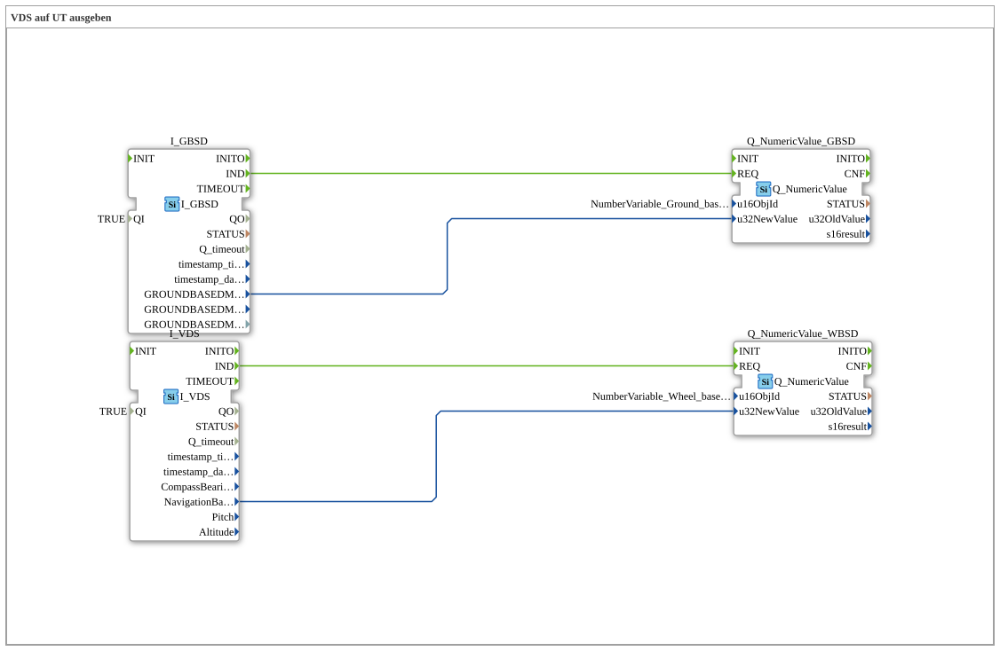

# Exercise_073: Outputting VDS to UT

[(https://notebooklm.google.com/notebook/a6872e59-1dfc-4132-a118-aff1bc7bc944)
This article describes the logiBUS® exercise `Uebung_073`. Here, the third speed source of the ISOBUS is explored: the navigation system.
----
## Objective of the Exercise

Use of the function block `I_VDS` (Vehicle Direction and Speed).

-----

## Description and Components

[cite_start]In `Uebung_073.SUB`, the radar speed (GBSD) and the GPS speed (VDS) are processed in parallel[cite: 1].

### Function Blocks (FBs)

- **`I_VDS`**: This block receives data from the tractor's GPS receiver (`NavigationBasedVehicleSpeed`).

-----

## Functionality

GPS data is particularly accurate when driving at a constant speed in open fields, but can become inaccurate during rapid acceleration or when driving under trees/near buildings. In modern systems, VDS is often used as a reference to calibrate radar sensors or to provide an alternative speed in case of a radar sensor failure.
