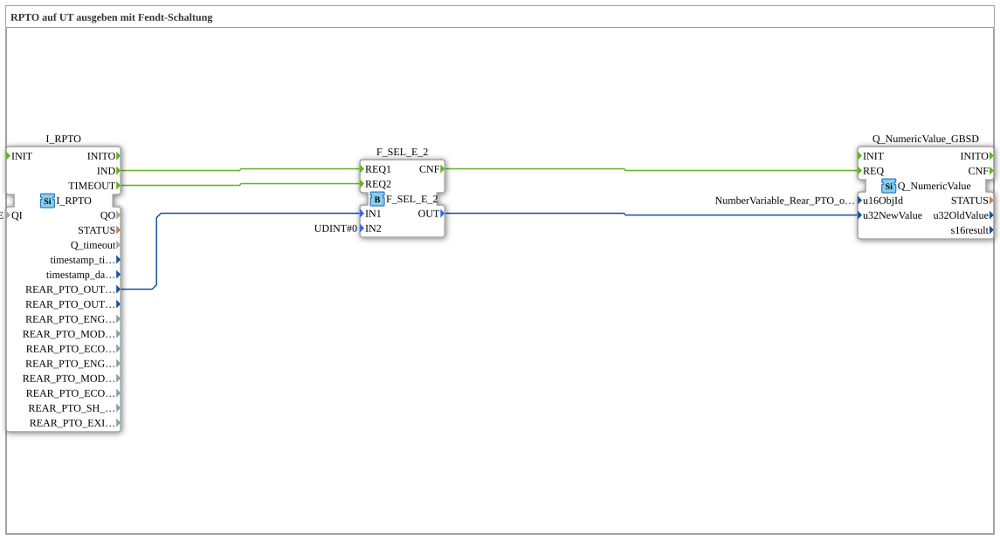

# Exercise_074: Outputting RPTO to UT

[](https://notebooklm.google.com/notebook/a6872e59-1dfc-4132-a118-aff1bc7bc944)

This article describes the logiBUS® exercise `Uebung_074`. Here, the speed of the rear PTO (Power Take-Off) is read in.

## 🎧 Podcast



* [Reverse Polarity Protection in Electronics: Why the Ideal Diode (LM74700) Beats MOSFETs and Schottky Diodes in Efficiency and Cost ](https://podcasters.spotify.com/pod/show/ms-muc-lama/episodes/Verpolungsschutz-in-der-Elektronik-Warum-die-ideale-Diode-LM74700-MOSFETs-und-Schottky-Dioden-in-Effizienz-und-Kosten-schlgt-e3a2487)

----

## Objective of the Exercise

Using the module `I_RPTO` (Rear PTO). This section demonstrates how to handle a peculiarity of some tractors: When the PTO shaft is off, some TECUs don't send a "zero" value, but simply stop transmitting messages.

-----

## Description and Components

[cite_start]In `Uebung_074.SUB`, a safety selector is used to guarantee a clean zero display[cite: 1].

### Function Blocks (FBs)

* **`I_RPTO`**: Outputs the engine speed at output `REAR_PTO_OUTP_SHAFT_SPEED`.

* **`F_SEL_E_2`**: Selects between the measured value and a fixed zero.

-----

## Operation ("Fendt Circuit")

1. **Normal Operation**: The TECU transmits engine speeds. `I_RPTO.IND` triggers the first input of the selector ➡️ The measured value is passed through to the terminal.

2. **Standstill**: If the TECU does not send any messages for an extended period, the function block `I_RPTO.TIMEOUT` fires.

3. **Safety**: This timeout event triggers the second input of the selector. Since the constant `0` is present here, the display on the terminal immediately reverts to "0 rpm". This prevents the last measured value (e.g., "540") from remaining permanently displayed even though the shaft has already stopped.

-----

## Application Example

**Implement Control with PTO Enabling**:

A slurry agitator may only operate if the PTO shaft has reached at least 300 rpm. The logic uses the `RPTO` value for enabling. The timeout protection ensures that the enable signal is immediately revoked as soon as the PTO shaft (and thus the TECU message) stops.

---

### 🌐 Related topic subpages on ms-muc-docs.de

* [🌐 Diode & Semiconductor Basics on ms-muc-docs.de ](https://www.ms-muc-docs.de/elektrotechnik/elektronik-i/diode/diode/)


```