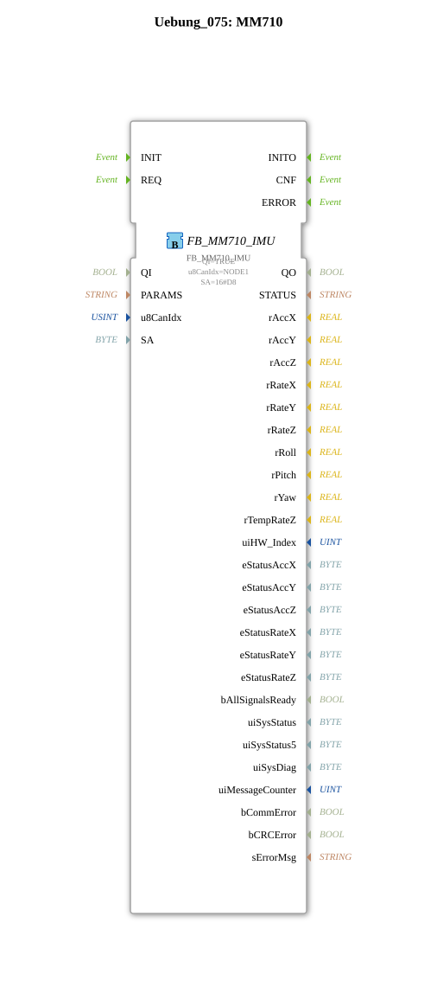

# Exercise_075: MM710

* * * * * * * * * *

## Introduction

This exercise demonstrates the integration of the function block **FB_MM710_IMU** for communication with an MM710 IMU sensor via the logiBUS. The sensor is controlled via the CAN bus and provides motion data. This exercise serves as a foundation for understanding the parameterization and use of CAN-based sensor blocks in 4diac.

## Function Blocks (FBs) Used

- **FB_MM710_IMU** (Type: `logiBUS::bosch::imu::FB_MM710_IMU`)
- **Parameters**:
- `QI` = `TRUE` (Activation of the block)
- `u8CanIdx` = `NODE1` (CAN node, defined by the import `isobus::pgn::ISO_CAN_NODE::NODE1`)
- `SA` = `16#D8` (Source address of the sensor in the CAN network)
- **Functionality**: The FB establishes the interface to the IMU sensor. Configuration and measurement data are exchanged via the CAN bus. Parameterization is performed using the specified values. This function block is designed for use in the logiBUS ecosystem.

## Program Flow and Connections

The SubApp contains **no further function blocks or sub-function blocks**. The entire functionality is implemented by the single function block `FB_MM710_IMU`. The SubApp has no inputs or outputs of its own – it serves as an encapsulated unit for integrating the IMU sensor.

**Process**:

1. After the PLC is activated, the function block is initialized with `QI = TRUE`.
2. The function block attempts to communicate with the sensor at address `0xD8` via the CAN bus.
3. After a successful connection, sensor data (e.g., acceleration, rotation rate) can be read (depending on the implementation of the function block).

**Learning Objectives**:

- Understanding the parameterization of a CAN-based IMU sensor.
- Introduction to the logiBUS concept and its connection to 4diac.
- Insight into the use of function blocks from the `logiBUS::bosch::imu` library.

**Prerequisites**:

- Basic knowledge of the 4diac IDE and the SubApplication Editor.
- Understanding of CAN bus communication (ISO 11783, PGN).

## Summary

Exercise **Exercise_075** demonstrates the basic integration of the MM710 IMU sensor via logiBUS. The `FB_MM710_IMU` function block is configured with the necessary parameters and encapsulated in a SubApp. This creates a reusable component that can be integrated into larger automation projects.

---

### 🌐 Related topic subpages on ms-muc-docs.de

- [🌐 Eclipse 4diac IDE & Color Reference on ms-muc-docs.de](https://www.ms-muc-docs.de/iec-61499/eclipse-4diac/)

]
