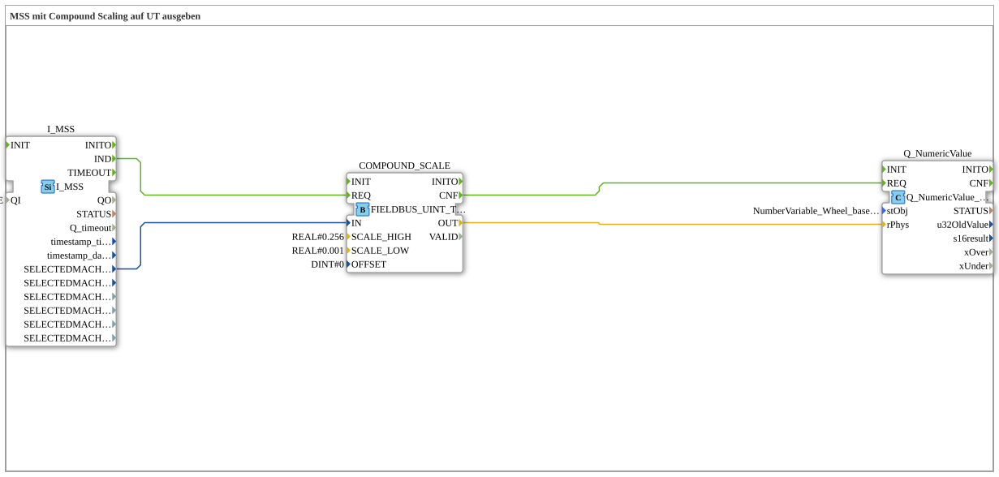

# Exercise_076: Outputting MSS to a UT using Compound Scaling

* * * * * * * * * *

## Introduction

This exercise implements a function for processing machine selected speed (MSS). The value is scaled using a compound scale function block and then output as a numeric value to a Universal Terminal (UT). The scaling is performed using upper and lower factors (0.256 and 0.001). A note indicates that the object pool entry used (NumberVariable_Wheel_based_machine_speed) is currently a placeholder and should later be replaced with the correct entry (NumberVariable_Machine_selected_speed).

## Function Blocks (FBs) Used

### Sub-Blocks: `I_MSS`

- **Type**: `isobus::tecu::I_MSS`
- **Parameters**:

- `QI` = `TRUE`
- **Functionality**:

This FB represents the input for the machine speed. Upon input at its event input `QI`, it outputs the current machine speed value (type: presumably UINT) at the data output `SELECTEDMACHINESPEED`. The event output `IND` signals that a new value is available.

### Sub-modules: `COMPOUND_SCALE`

- **Type**: `logiBUS::signalprocessing::fieldbus::FIELDBUS_UINT_TO_SIGNAL_COMPOUND_SCALE`

- **Parameters**:

- `SCALE_HIGH` = `REAL#0.256`

- `SCALE_LOW` = `REAL#0.001`

- `OFFSET` = `DINT#0`

- **Functionality**:

This function block performs compound scaling of an unsigned integer (UINT) value. The incoming value `IN` is multiplied by two different scaling factors to achieve higher accuracy in the lower and upper ranges of the value. The output `OUT` returns the scaled value (type: REAL). The event input `REQ` starts the calculation; upon completion, a signal is output at the event output `CNF`.

### Sub-Blocks: `Q_NumericValue`

- **Type**: `isobus::UT::Q::Q_NumericValue_PHYS`

- **Parameters**:

- `stObj` = `NumberVariable_Wheel_based_machine_speed`

- **Functionality**:

This function block outputs a numeric value to the Universal Terminal. The passed physical value (input `rPhys`, type: REAL) is sent to the UT according to the properties of the referenced object pool entry (`stObj`). The event input `REQ` triggers the output.

## Program Flow and Connections

The process takes place entirely internally within the subapplication type (no external interfaces). The connections between the function blocks are as follows:

**Event Connections**:

1. `I_MSS.IND` → `COMPOUND_SCALE.REQ`

As soon as a new MSS value is received, scaling is triggered.

2. `COMPOUND_SCALE.CNF` → `Q_NumericValue.REQ`

After scaling is complete, the output value is sent to the UT (User Task).

**Data Connections**:

1. `I_MSS.SELECTEDMACHINESPEED` → `COMPOUND_SCALE.IN`

The raw machine speed value (UINT) is forwarded to the scaling block.

2. `COMPOUND_SCALE.OUT` → `Q_NumericValue.rPhys`

The scaled value (REAL) is passed as the physical value for the UT output.

A comment on the network indicates that the object pool entry used, `NumberVariable_Wheel_based_machine_speed`, is only a placeholder. In a final implementation, this should be replaced by `NumberVariable_Machine_selected_speed`.

## Summary

Exercise `Uebung_076` demonstrates the processing of a machine speed using compound scaling and its subsequent output to a universal terminal. The data flow is linear: The input value is scaled and then passed to the UT as a physical quantity. The scaling parameters are fixed (0.256 for the upper range, 0.001 for the lower range). The exercise demonstrates the use of ISOBUS-specific function blocks (I_MSS, Q_NumericValue) as well as a generic fieldbus scaling block. The TODO comment indicates a necessary adjustment to the object pool entry.