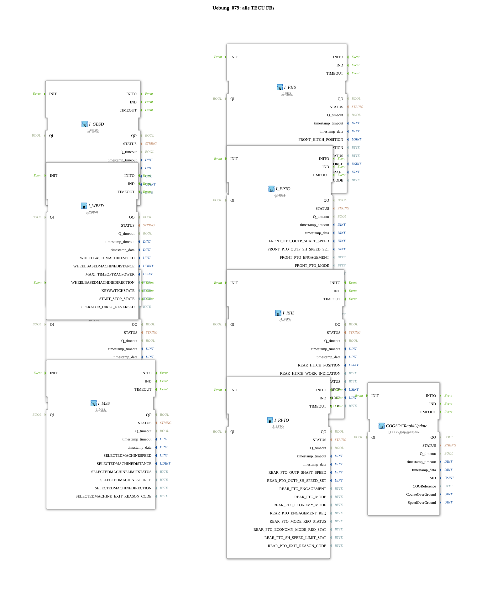

# Exercise_079: All TECU Function Blocks

[(https://notebooklm.google.com/notebook/a6872e59-1dfc-4132-a118-aff1bc7bc944)
This article describes the logiBUS® exercise `Uebung_079`. This is a comprehensive exercise that introduces all available function blocks for acquiring tractor information.
----
## Objective of the Exercise

To learn the entire range of TECU interface function blocks. An ISOBUS tractor reports a variety of physical values via the CAN bus, which can be used directly as function blocks in 4diac.

-----

## Overview of the Function Blocks (FBs)

[cite_start]All relevant TECU input function blocks are located in `Uebung_079.SUB`[cite: 1]:

1. **`I_GBSD`**: Ground Based Speed & Distance (Radar/GPS position).
2. **`I_WBSD`**: Wheel Based Speed & Distance (Transmission position).
3. **`I_VDS`**: Vehicle Direction and Speed (Navigation data).
4. **`I_RPTO` & `I_FPTO`**: Rear and Front PTO Speed (Rear/Front Power Take-Off).
5. **`I_RHS` & `I_FHS`**: Rear and front hitch position (Rear/Front Hitch Status).
6. **`I_MSS`**: Machine Specific Status.
7. **`COGSOGRapidUpdate`**: High-frequency heading and ground speed data.

-----

## Practical Application

Each of these modules listens for the standardized ISOBUS messages of the respective tractor ECU. The logiBUS system ensures that this complex protocol data is converted into simple IEC 61499 events and data values. The developer does not need to worry about CAN IDs or bit masks, but can work directly with physical quantities such as "RPM" or "position".

---

### 🌐 Related topic subpages on ms-muc-docs.de

* [🌐 Eclipse 4diac IDE & Color Reference on ms-muc-docs.de](https://www.ms-muc-docs.de/iec-61499/eclipse-4diac/)
* [🌐 IEC 61499 Events – The Pulse of Automation on ms-muc-docs.de](https://www.ms-muc-docs.de/iec-61499/events/event/)

]