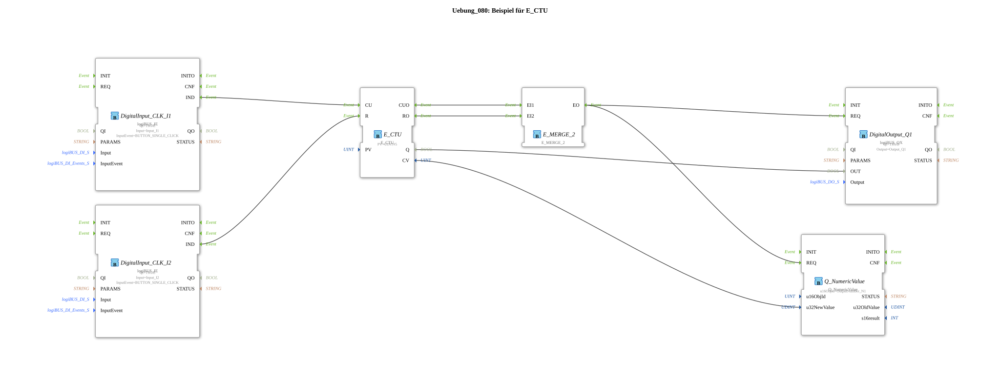

# Exercise_080: Example for E_CTU

This article describes the logiBUS® exercise `Uebung_080`. It introduces the basic principle of event counting.
## 🎧 Podcast

* [800 HP High-Tech Giant: What the ROPA Tiger 6S Operating Manual Reveals About Modern Agriculture and Extreme Safety ](https://podcasters.spotify.com/pod/show/ms-muc-lama/episodes/800-PS-Hightech-Riese-Was-die-Betriebsanleitung-des-ROPA-Tiger-6S-ber-moderne-Landwirtschaft-und-extreme-Sicherheit-verrt-e3aub4t)

----

## Objective of the Exercise

Using the function block `E_CTU` (Event Count Up). It demonstrates how to record a specific number of events (e.g., key presses) and trigger an action when a threshold is reached.

-----

## Description and Components

[cite_start]The subapplication `Uebung_080.SUB` uses a counter block with set and reset logic[cite: 1].

### Function Blocks (FBs)
* **`DigitalInput_I1` (Count)**: Each click increments the counter.
* **`DigitalInput_I2` (Reset)**: Resets the counter to zero.
* **`E_CTU`**: The counter block. [cite_start]The parameter `PV` (Preset Value) is set to 5[cite: 1].
* **`DigitalOutput_Q1`**: Displays the counter status.

-----

## Functionality

1. The user clicks on **I1**. The counter reading (`CV`) increments with each event.

2. The counter's output `Q` changes to `TRUE` as soon as the counter reading reaches or exceeds 5 (`CV >= PV`).

3. The lamp on **Q1** illuminates.

4. Clicking **I2** resets the counter; `Q` reverts to `FALSE`, and the lamp turns off.

-----

## Application Example

**Piece Counter**: A packaging machine counts the cartons. As soon as there are 5 cartons on the pallet, a signal (`Q1`) is sent to automatically eject the pallet. After picking up a new pallet, the driver presses "Reset" (`I2`) to start the next process.

---

### 🌐 Related topic subpages on ms-muc-docs.de
* [🌐 E_CTU Event Counter module on ms-muc-docs.de](https://www.ms-muc-docs.de/iec-61499/event-function-blocks/e_ctu/)
