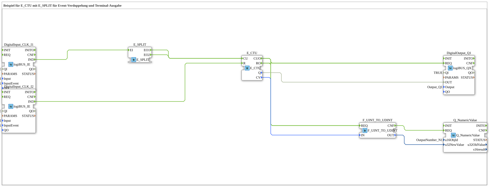

# Exercise_080b: Example for E_CTU with E_SPLIT for Event Doubling and Terminal Output

This article describes the logiBUS® exercise `Uebung_080b`. It demonstrates how to artificially double the number of incoming events.
----
## Objective of the Exercise

Manipulation of event streams using `E_SPLIT`.

-----

## Functionality

[cite_start]In `Uebung_080b.SUB`, an event splitter is placed before the counter[cite: 1].

Each individual click of button **I1** reaches input `E_SPLIT.EI`. The splitter then fires **two** events (`EO1` and `EO2`) sequentially. Since both outputs are merged back into the counter's `CU` input, the counter receives two pulses per button press.

**Result**: The lamp `Q1` (threshold 5) illuminates after the third button press (the counter reading has then already jumped to 6).

**Result**: -----

## Application Example

Adapting Sensor Pulses: A gear sensor delivers one pulse per wheel revolution, but the logic requires two pulses per revolution for more accurate calculations. The splitter doubles the incoming frequency in software.

--

### 🌐 Related Topic Subpages on ms-muc-docs.de

* [🌐 E_CTU Event Counter Block on ms-muc-docs.de](https://www.ms-muc-docs.de/iec-61499/event-function-blocks/e_ctu/)

]