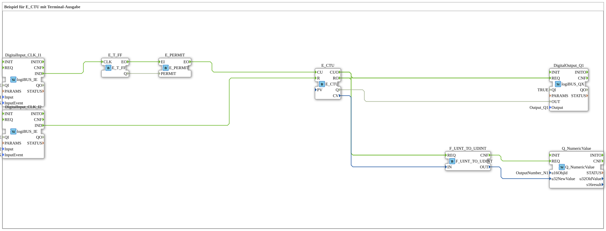

# Exercise_080c: Example for E_CTU with Terminal Output

This article describes the logiBUS® exercise `Uebung_080c`. Here, the opposite of the previous exercise is demonstrated: reducing the number of events by half.
----
## Objective of the Exercise
Manipulation of event streams using `E_T_FF` and `E_PERMIT`.

-----

## Functionality

[cite_start]In `Uebung_080c.SUB`, a toggle flip-flop is used as a gate monitor[cite: 1].

1. Each click on **I1** toggles the flip-flop. The state cycles through: TRUE, FALSE, TRUE, FALSE...

2. The `E_PERMIT` only allows events to pass through when the `PERMIT` input is TRUE.

3. Therefore, an event is only passed to the counter on every second click (when the flip-flop is currently TRUE).

**Result**: To illuminate the lamp `Q1` (threshold 5), the user must now click the button 10 times.

-----

## Application Example

Suppression of bounce effects or coarse scaling of fast sensor signals to reduce the computational load of subsequent logic.

---

### 🌐 Related topic subpages on ms-muc-docs.de
* [🌐 E_CTU Event Counter module on ms-muc-docs.de](https://www.ms-muc-docs.de/iec-61499/event-function-blocks/e_ctu/)
