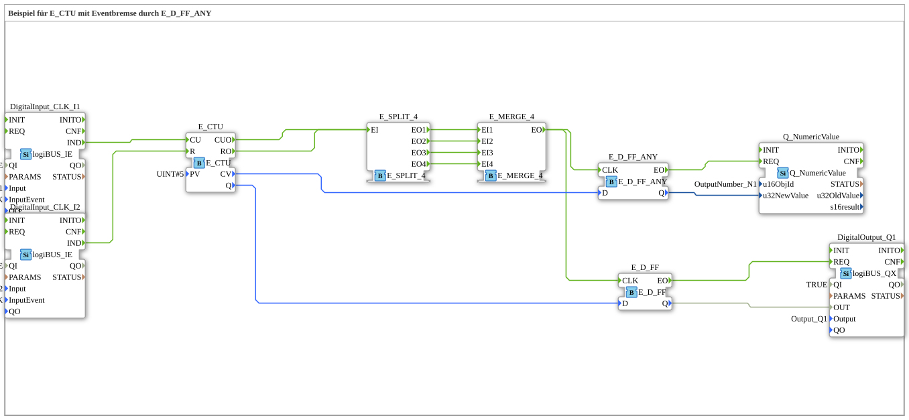

# Exercise_080d: Example for E_CTU with Event Brake using E_D_FF_ANY



* * * * * * * * * *

## Introduction

This exercise demonstrates the use of an up counter (`E_CTU`) in combination with an **event brake**, implemented using the two flip-flops `E_D_FF_ANY` and `E_D_FF`.

The counter value and the Boolean output signal (overflow or reaching the limit) are **only** passed to the outputs when an event is triggered by the counter (count pulse or reset). This prevents the outputs from being unnecessarily updated with every system clock cycle.

## Function Blocks Used (FBs)

The following function blocks are included in the subapplication network:

- **DigitalOutput_Q1** (Type: `logiBUS_QX`)

- Parameters: `QI = TRUE`, `Output = Output_Q1`

- **DigitalInput_CLK_I1** (Type: `logiBUS_IE`)

- Parameters: `QI = TRUE`, `Input = Input_I1`, `InputEvent = BUTTON_SINGLE_CLICK`

- **DigitalInput_CLK_I2** (Type: `logiBUS_IE`)

- Parameters: `QI = TRUE`, `Input = Input_I2` `InputEvent = BUTTON_SINGLE_CLICK`

- **E_CTU** (Type: `E_CTU`)

- Parameter: `PV = UINT#5`

- **E_SPLIT_4** (Type: `E_SPLIT_4`)

- No parameters

- **E_MERGE_4** (Type: `E_MERGE_4`)

- No parameters

- **E_D_FF_ANY** (Type: `E_D_FF_ANY`)

- No parameters

- **E_D_FF** (Type: `E_D_FF`)

- No parameters

- **Q_NumericValue** (Type: `Q_NumericValue`)

- Parameter: `u16ObjId = OutputNumber_N1`

## Program Flow and Connections

1. **Inputs**

- Button **I1** (Single-Click) is connected to `DigitalInput_CLK_I1` and generates an event at output `IND`.

- Button **I2** (Single-Click) is connected to `DigitalInput_CLK_I2` and also generates an event at `IND`.

2. **Counter E_CTU**

- The event output of `DigitalInput_CLK_I1` is routed to input `CU` (Count Up) of the counter.

- The event output of `DigitalInput_CLK_I2` is routed to the counter's input `R` (Reset).

- The counter increments its current value with each pulse on I1. Upon reaching the threshold `PV = 5`, the output `Q = TRUE` is triggered. A reset sets the counter value to 0 and `Q` to FALSE.

- The event outputs `CUO` (after successful counting) and `RO` (after reset) are each triggered.
... 3. **Event-Brake Logic**

- Both events (`CUO` and `RO`) are distributed to four outputs via the **E_SPLIT_4** function block.

- The four outputs are combined into a single event in **E_MERGE_4**. Each incoming pulse thus generates a single event at output `EO`.

- This combined event serves as the clock signal (`CLK`) for the two flip-flops:

- **E_D_FF_ANY** stores the current counter value (`CV`) and outputs it on each clock signal.

- **E_D_FF** stores the Boolean output (`Q`) of the counter and also outputs it on each clock cycle.

4. **Outputs**

- The stored counter value of `E_D_FF_ANY` is output as a numeric value on the display `OutputNumber_N1` via the **Q_NumericValue** function block.

- The stored Boolean value of `E_D_FF` is switched to the digital output `Output_Q1` via **DigitalOutput_Q1**.

This chaining ensures that the outputs are only updated when the counter actually takes a step (count or reset) – not on every system clock cycle. This corresponds to an **event-driven brake**.


## Summary

This exercise illustrates the coupling of event and data flows in a 4diac IDE subapplication.

The up counter is controlled by two pushbuttons. Its current values (counter reading and overflow signal) are passed to flip-flops, which serve as memory, via a combination of event splitters and mergers. The flip-flops only pass the stored data when a counting or reset event occurs. This prevents unnecessary updates and demonstrates how an **event brake** can be implemented using simple means.


``` ---

### 🌐 Related topic subpages on ms-muc-docs.de

* [🌐 E_CTU Event Counter module on ms-muc-docs.de](https://www.ms-muc-docs.de/iec-61499/event-function-blocks/e_ctu/)

* [🌐 Eclipse 4diac IDE & Color Reference on ms-muc-docs.de](https://www.ms-muc-docs.de/iec-61499/eclipse-4diac/)

]