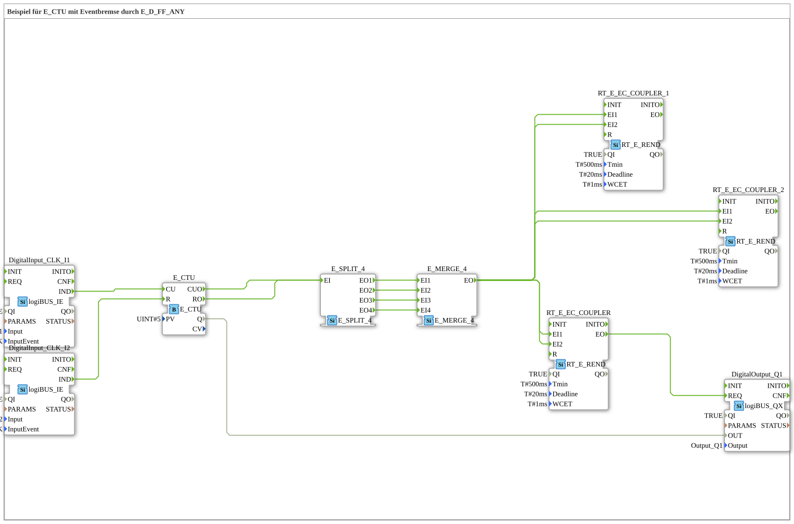

# Exercise_080e: Example for E_CTU with Event Brake using E_D_FF_ANY

* * * * * * * * * *

## Introduction

This exercise demonstrates the use of an up counter (`E_CTU`) in conjunction with an event brake, implemented using `RT_E_REND` function blocks. The counter is controlled by two pushbuttons (single-click pushbuttons): one for counting (CU) and another for resetting (R). The count result is output to a digital output. The event brake provides time-based debouncing and decoupling of the events. No sub-application blocks are used; all function blocks are standard or device-specific library elements.

## Function Blocks Used (FBs)

- **DigitalInput_CLK_I1**
- **Type**: `logiBUS::io::DI::logiBUS_IE`
- **Parameters**:
- `QI` = `TRUE`
- `Input` = `Input_I1`
- `InputEvent` = `BUTTON_SINGLE_CLICK`
- **Function**: Generates an event at output `IND` when a key is pressed (single click). Serves as a counting pulse for the up counter.
- **DigitalInput_CLK_I2**
- **Type**: `logiBUS::io::DI::logiBUS_IE`
- **Parameters**:
- `QI` = `TRUE`
- `Input` = `Input_I2`
- `InputEvent` = `BUTTON_SINGLE_CLICK`
- **Function**: Generates an event at output `IND` when a key is pressed. Serves as a reset signal for the counter.
- **E_CTU** (Up Counter)
- **Type**: `iec61499::events::E_CTU`
- **Parameters**:
- `PV` = `UINT#5`
- **Event Inputs/Outputs**:
- `CU` (count)
- `R` (reset)
- `CUO` (output after count event)
- `RO` (output after reset)
- **Data Output**:
- `Q` (current counter value, as `UINT`)
- **Function**: Counts on each An event at `CU` increments the counter (starting at 0) until the value `PV` (here 5) is reached; then `Q` is set. An event at `R` resets the counter.
- **E_SPLIT_4**
- **Type**: `iec61499::events::E_SPLIT_4`
- **Function**: Distributes an incoming event (at `EI`) to up to four outputs (`EO1`–`EO4`). Used for parallel processing based on counter events.

**E_SPLIT_4**
**Type**: `iec61499::events::E_SPLIT_4`
**Function**: Distributes an incoming event (at `EI`) to up to four outputs (`EO1`–`EO4`). Used for parallel processing based on counter events.**

**** - **E_MERGE_4**

- **Type**: `iec61499::events::E_MERGE_4`
- **Function**: Combines up to four incoming events (at `EI1`–`EI4`) into a single output (`EO`). Then, it merges the parallel branches back into a single event stream.

- **RT_E_EC_COUPLER** (three instances)

- **Type**: `eclipse4diac::rtevents::RT_E_REND`
- **Parameters** (for all three):
- `QI` = `TRUE`
- `Tmin` = `T#500ms`
- `Deadline` = `T#20ms`
- `WCET` = `T#1ms`
- **Event Inputs**: `EI1`, `EI2`
- **Event Outputs**: `EO`
- **Function**: Ensures a time-based decoupling and a minimum interval of 500 ms between events. It acts as an "event brake" to smooth out rapid typing sequences.

- **DigitalOutput_Q1**

- **Type**: `logiBUS::io::DQ::logiBUS_QX`
- **Parameters**:
- `QI` = `TRUE`
- `Output` = `Output_Q1`
- **Event Input**: `REQ`
- **Data Input**: `OUT` (from the counter reading `Q` of `E_CTU`)
- **Function**: Switches the digital output Q1 to the value present at the data input as soon as an event arrives at `REQ`.

## Program Flow and Connections

1. **Input Events**:

- A single click on the button at `Input_I1` generates an event at `DigitalInput_CLK_I1.IND`.
- A single click on the button at `Input_I2` generates an event at `DigitalInput_CLK_I2.IND`.
1. **Counter Control**:

- The event at `DigitalInput_CLK_I1.IND` is connected to the input at `E_CTU.CU` – increments the counter.
- The event at `DigitalInput_CLK_I2.IND` is connected to the input at `E_CTU.R` – resets the counter.
1. **Event Distribution and Merging**:

- Outputs `E_CTU.CUO` and `E_CTU.RO` are connected to the common input `E_SPLIT_4.EI` (both events trigger the same split).
- The four outputs `EO1`–`EO4` are connected to the four inputs `EI1`–`EI4` of `E_MERGE_4`. This ensures that each counter or reset event is passed through four times (redundantly here to serve all outputs).
- The merge output `EO` combines these into a single event stream.
1. **Event Brake (RT_E_REND)**:

- The combined event is applied to the inputs `EI1` and `EI2` of all three `RT_E_REND` function blocks.
- The output `EO` of the first `RT_E_REND` triggers the `REQ` input of the digital output function block `DigitalOutput_Q1`.
- The other two `RT_E_REND` are also present in the network (possibly prepared for additional outputs or redundancy), but are not directly connected to a subsequent function block in the current data flow.
...`` `` `` `**Event Brake (RT_E_REND) (Return to the input `RT_E_REND`)
``EI1` and `EI2`` ``RT_E_REND`` `qzmsdocs000 5. **Data Flow**:

- The current counter value `E_CTU.Q` is directly connected to the data input `DigitalOutput_Q1.OUT`. With each event at `REQ`, this value is transferred to the physical output `Output_Q1`.

**Learning Objectives of this Exercise**:

- Understanding the up counter `E_CTU` in IEC 61499.
- Using event split and merge for parallel processing.
- Using `RT_E_REND` as a time-debouncing (event brake) to stabilize signal processing.

**Difficulty Level**: Advanced (event control with multiple function blocks).

**Required prior knowledge**: Basic knowledge of the 4diac IDE, building simple controllers with digital inputs/outputs.

**Starting the exercise**: Insert the SubApp into an empty project, connect the buttons and the output according to the hardware (e.g., logiBUS).

## Summary

This exercise demonstrates a typical counter application with two buttons, where an up counter is incremented and reset by touch buttons. The counter value is output to a digital output. By using the `E_SPLIT_4`, `E_MERGE_4`, and especially the `RT_E_REND` function blocks, the event processing is made robust against rapid tap sequences – the event brake enforces a minimum time of 500 ms between two processing steps. This prevents unwanted multiple outputs and decouples the input from the output.

---

### 🌐 Related topic subpages on ms-muc-docs.de

- [🌐 E_CTU Event Counter module on ms-muc-docs.de](https://www.ms-muc-docs.de/iec-61499/event-function-blocks/e_ctu/)
- [🌐 Eclipse 4diac IDE & Color Reference on ms-muc-docs.de](https://www.ms-muc-docs.de/iec-61499/eclipse-4diac/)

]
